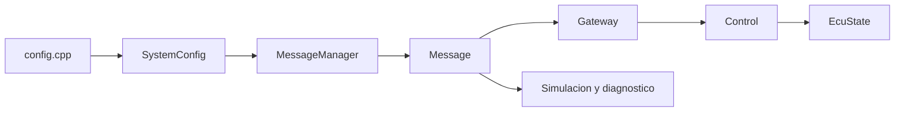

# myECU

Simulador educativo de una ECU automotriz desarrollado en C++11. El proyecto modela la adquisicion de senales, la actualizacion de mensajes, la validacion de rangos y timeout, y una maquina de estados de control con modos operacional, degradado y seguro.

> **Estado del proyecto:** prototipo de simulacion. No es software listo para instalarse directamente en un vehiculo ni implementa aun drivers reales de CAN, LIN, ADC, SENT, diagnostico UDS o un RTOS.

## Caracteristicas

- Modelo de mensajes de sensores con valores actuales, limites, estado y timestamp.
- Metadatos de sensores almacenados una sola vez y consultados mediante `SensorId`.
- Validacion de senales por rango y timeout.
- Maquina de estados ECU:
  - `INIT`
  - `SELF_TEST`
  - `OPERATIONAL`
  - `DEGRADED`
  - `SAFE_STATE`
  - `SHUTDOWN`
- Simulacion interactiva por consola.
- Simulacion automatica con valores aleatorios.
- Compilacion reproducible mediante `Makefile`.

## Requisitos

- Linux, WSL o un entorno compatible con POSIX para la simulacion de terminal.
- `g++` con soporte para C++11.
- `make`.

El `Makefile` compila con:

```text
g++ -Wall -Wextra -pedantic -std=c++11
```

## Estructura del proyecto

```text
.
├── main.cpp                 # Punto de entrada y seleccion de simulacion
├── Makefile                 # Compilacion, ejecucion y limpieza
├── include/
│   ├── control.hpp          # Maquina de estados y control de senales
│   ├── getaway.hpp          # Validacion de mensajes
│   ├── message.hpp          # Modelo Message y enumeraciones
│   ├── mssgmanager.hpp      # Inicializacion y actualizacion de mensajes
│   ├── simulations.hpp      # Interfaz de simulaciones
│   └── utils.hpp            # Utilidades, tiempo, aleatoriedad y colores
├── src/
│   ├── control.cpp
│   ├── getaway.cpp
│   ├── message.cpp           # Implementacion del modelo Message
│   ├── config.cpp            # Configuracion central de sensores y ECU
│   ├── mssgmanager.cpp
│   ├── simulations.cpp
│   └── utils.cpp
└── build/                   # Archivos objeto generados por make
```

## Flujo de ejecucion



El flujo comun de ambas simulaciones es:

1. Se inicializa un `Message` por cada entrada de `INIT_VALUES`.
2. Se actualiza el valor y timestamp de cada senal.
3. `Gateway` valida timeout y rango.
4. `Control` procesa el estado de cada senal.
5. La simulacion muestra el estado y los mensajes.

## Sensores configurados

Actualmente `config.cpp` configura 10 senales:

| `SensorId` | Descripcion | Unidad | Critica |
|---|---|---:|:---:|
| `SHUT_REQ` | Solicitud de apagado | `S_R` | No |
| `BRAKE` | Solicitud de freno | `BRK` | No |
| `SPEED` | Velocidad | `km/h` | No |
| `RPM` | Revoluciones por minuto | `RPM` | Si |
| `TEMP` | Temperatura | `C` | Si |
| `VOLTAGE` | Voltaje | `V` | Si |
| `TPS` | Posicion de mariposa | `V` | No |
| `MAP` | Presion absoluta | `V` | No |
| `MAF` | Flujo de masa de aire | `g/s` | No |
| `O2` | Sensor de oxigeno | `V` | No |

Los nombres, unidades, limites, criticidad y timeout se guardan en la configuracion de cada senal y se transfieren al `Message`. La logica no depende de que los valores de `SensorId` sean posiciones consecutivas.

## Clases y enumeraciones

### `Message`

Representa el estado de una senal. Almacena:

- `messageId`: identificador externo del mensaje.
- `sensorId`: tipo de sensor y clave de sus metadatos.
- `rawValue`: valor actual.
- `minValue` y `maxValue`: limites permitidos.
- `status`: resultado de la validacion.
- `isCritic`: indica si una falla debe tratarse como critica.
- `timestampMs`: instante de la ultima actualizacion.

Funciones principales:

| Funcion | Uso |
|---|---|
| `setRawValue()` | Actualiza el valor de la senal. |
| `setTimesStamp()` | Actualiza el timestamp. |
| `getName()` | Obtiene el nombre configurado para la senal. |
| `getUnit()` | Obtiene la unidad configurada para la senal. |
| `getSignalStatus()` | Consulta `VALID`, `OUT_OF_RANGE`, `TIMEOUT` o `UNDEFINED`. |
| `getMessageString()` | Genera una representacion detallada. |
| `getStdMessageString()` | Genera una representacion legible. |
| `getStdColorsMessageString()` | Genera una representacion legible con colores ANSI. |

### `MessageManager`

Gestiona el ciclo de vida basico de los mensajes:

- `InitMessage()`: construye un `Message` a partir de `InitValues`.
- `UpdateMessage()`: actualiza valor y timestamp sin modificar los limites.

`InitValues` contiene la configuracion inicial de cada senal: ID, tipo, nombre, unidad, valor inicial, rango, criticidad, timeout y comportamiento de apagado.

### `SystemConfig`

`config.cpp` construye la configuracion del sistema. Contiene la lista de sensores y el maximo de senales invalidas permitido antes de pasar a `SAFE_STATE`.

### `Gateway`

Valida cada mensaje mediante `validateMessage()`:

1. Comprueba si el timestamp supera `MAXIMUM_TIME_IN_MS`.
2. Si expiro, asigna `SignalStatus::TIMEOUT`.
3. Si no expiro, comprueba que el valor este entre minimo y maximo.
4. Asigna `VALID` o `OUT_OF_RANGE`.

Cada senal tiene su propio timeout configurado.

### `Control`

Implementa la logica de control y la maquina de estados.

- `processMessage()`: registra la validez de la senal, atiende la solicitud de apagado y ejecuta las transiciones de estado.
- `reset()`: restablece el estado inicial y los errores.
- `getCurrentState()`: devuelve el estado actual.
- `printCurrentState()`: muestra el estado actual por consola.

Una condicion critica lleva a `SAFE_STATE`. Una solicitud de apagado lleva a `SHUTDOWN`. Durante `SELF_TEST`, el voltaje debe validarse en su limite superior para pasar a `OPERATIONAL`.

### Funciones de simulacion

En `src/simulations.cpp`:

- `initializeMessages()`: inicializa el arreglo de mensajes.
- `validateMessages()`: valida todas las senales.
- `processMessages()`: procesa todas las senales mediante `Control`.
- `printMessages()`: imprime el estado de cada senal.
- `userSimulation()`: solicita manualmente el valor de cada sensor.
- `randomSimulation()`: actualiza senales automaticamente con valores aleatorios.

### Utilidades

En `utils.cpp` y `utils.hpp`:

- `cleanScreen()`: limpia la consola.
- `get_timestamp_ms()`: obtiene el tiempo actual en milisegundos.
- `get_generator()`: proporciona el generador aleatorio.
- `randomInt()` y `randomFloat()`: generan valores aleatorios.
- `isNumber()`: comprueba si una cadena representa un numero.
- Constantes `TXT_*`: colores ANSI para la consola.

## Compilacion

Desde la raiz del repositorio:

```bash
make
```

El target por defecto es equivalente a `make build` y genera el ejecutable `ecu`.

Comandos disponibles:

| Comando | Descripcion |
|---|---|
| `make` | Compila el proyecto. |
| `make all` | Alias del target por defecto. |
| `make build` | Compila y muestra confirmacion de build. |
| `make compile` | Compila el ejecutable. |
| `make run` | Ejecuta la simulacion interactiva sin recompilar. |
| `make info` | Muestra compilador, flags, fuentes y ejecutable. |
| `make clean` | Elimina `ecu` y los objetos de `build/`. |
| `make distclean` | Elimina tambien el directorio `build/`. |

Para recompilar desde cero:

```bash
make distclean
make build
```

## Ejecucion de las simulaciones

### Simulacion interactiva

```bash
make run
```

Tambien puede ejecutarse directamente:

```bash
./ecu
```

Menu disponible:

1. Introducir los valores de las senales.
2. Mostrar el estado del sistema.
3. Salir.

### Simulacion automatica

```bash
./ecu -auto
```

La simulacion automatica actualiza los valores cada 500 ms. Las senales no binarias reciben valores aleatorios dentro de sus limites mas una tolerancia de 10 unidades.

Durante la ejecucion:

- `B` o `b`: activa o desactiva la solicitud de freno.
- `S` o `s`: solicita el apagado y termina la simulacion.

La simulacion automatica usa entrada de terminal no bloqueante, por lo que requiere un entorno POSIX.

### Valores recomendados para pruebas manuales

En la simulacion interactiva, selecciona la opcion `1` e introduce los valores en el orden en que aparecen en la tabla. Los valores normales permiten comprobar el arranque y la operacion; los valores fuera de rango permiten observar los estados de advertencia o seguridad.

| Senal | Valor normal | Valor de prueba fuera de rango | Resultado esperado |
|---|---:|---:|---|
| `SHUT_REQ` | `0` | `1` | `1` solicita `SHUTDOWN`. |
| `BRAKE` | `0` | `1` | Simula una solicitud de freno. |
| `SPEED` | `60` | `250` | Fuera de rango; `0` tambien permite probar parada segura. |
| `RPM` | `2000` | `7500` | Senal critica fuera de rango; puede llevar a `SAFE_STATE`. |
| `TEMP` | `90` | `150` | Senal critica fuera de rango; puede llevar a `SAFE_STATE`. |
| `VOLTAGE` | `16` | `7` | `16` permite superar el self-test; `7` lo hace fallar. |
| `TPS` | `2.5` | `5.0` | Fuera de rango si supera `4.8`. |
| `MAP` | `2.0` | `5.0` | Fuera de rango si supera `4.7`. |
| `MAF` | `40` | `130` | Fuera de rango si supera `120`. |
| `O2` | `0.45` | `1.0` | Fuera de rango si supera `0.9`. |

Secuencia sugerida para una prueba basica:

1. Introduce los valores normales de la tabla, usando `16` V para `VOLTAGE`; el sistema deberia avanzar hacia `OPERATIONAL`.
2. Repite la carga con `7500` RPM o `150` C; observa la transicion a `SAFE_STATE`.
3. Restaura todos los valores normales para comprobar la recuperacion.
4. Usa `1` en `BRAKE` para simular el freno.
5. Usa `1` en `SHUT_REQ` para probar la transicion a `SHUTDOWN`.

Los valores fuera de rango no sustituyen pruebas de seguridad ni validan un ECU real; solo comprueban la logica implementada por la simulacion.

## Analisis de memoria

Las mediciones siguientes corresponden al build actual en Linux con `g++` y no representan directamente un mapa de memoria de un microcontrolador.

### Tamano de las clases

| Tipo | Tamano medido |
|---|---:|
| `Message` | 32 bytes |
| `InitValues` | 24 bytes |
| `Control` | 48 bytes |
| `Gateway` | 1 byte |
| `MessageManager` | 1 byte |

Cada sensor configurado reserva actualmente:

```text
sizeof(InitValues) + sizeof(Message)
= 24 + 32
= 56 bytes por sensor
```

Con los 10 sensores actuales:

```text
10 x 56 = 560 bytes
```

A esto se suman los objetos de control y la memoria global de las librerias. En la medicion del ejecutable actual:

| Segmento | Tamano |
|---|---:|
| Codigo (`text`) | 45.216 bytes |
| Datos inicializados (`data`) | 1.312 bytes |
| BSS | 10.736 bytes |
| Total mostrado por `size` | 57.264 bytes |

La mayor parte del BSS corresponde al generador `std::mt19937` usado por la simulacion. Las funciones que construyen `std::string` para imprimir mensajes pueden usar memoria temporal, pero los textos de nombre y unidad ya no se almacenan dentro de cada `Message`.

### Estimacion para un MCU automotriz

Si se usa este modelo de 56 bytes por sensor como referencia puramente de almacenamiento:

| RAM total del MCU | Maximo matematico aproximado, antes de reservas |
|---:|---:|
| 112 KB | ~2.000 sensores |
| 192 KB | ~3.500 sensores |
| 512 KB | ~9.300 sensores |

Estos maximos no son apropiados para produccion. Un ECU tambien necesita RAM para stack, RTOS o scheduler, drivers, buffers CAN/LIN, diagnostico, calibraciones, watchdog, seguridad y margen ante picos de carga.

Una planificacion mas realista para este proyecto seria:

- MCU pequeno de 112 KB: **100-250 sensores**.
- MCU medio de 192 KB: **250-500 sensores**.
- MCU de 512 KB: **500-1.000 sensores**.

La memoria dejaria de ser el primer limite en esos rangos. El limite practico probablemente seria la carga de comunicaciones, la frecuencia de actualizacion, el tiempo maximo de cada tarea y la cantidad de procesamiento asociado a cada senal.

### Limitaciones de la estimacion

- `SensorsArray` e `INIT_VALUES` se crean actualmente en el stack de `main()`.
- `std::string` sigue usandose para construir salidas de diagnostico.
- La tabla de metadatos usa punteros a textos constantes; el tamano exacto de esos punteros depende de la arquitectura.
- No se han medido aun stack maximo, heap maximo, uso de CPU ni buffers de comunicaciones reales.
- `Control::validSignals` debe dimensionarse explicitamente para que el seguimiento de validez por senal sea efectivo.
- La simulacion automatica espera 500 ms por ciclo, pero ese periodo no es una garantia de tiempo real.

Para una cifra de produccion se necesita compilar para el MCU objetivo, generar un mapa de memoria del linker y medir WCET, stack, heap, buffers de red y carga de CPU bajo la maxima frecuencia de senales.

## Seguridad y uso previsto

Este repositorio tiene finalidad educativa y de prototipado. Antes de usar una arquitectura similar en un ECU real se requeririan, como minimo, requisitos trazables, analisis de seguridad funcional ISO 26262, pruebas de unidad e integracion, pruebas de fallo, diagnostico, watchdog, control de concurrencia, validacion temporal y una plataforma automotriz calificada.

## Licencia

Este proyecto se distribuye bajo la licencia [MIT](LICENSE).
