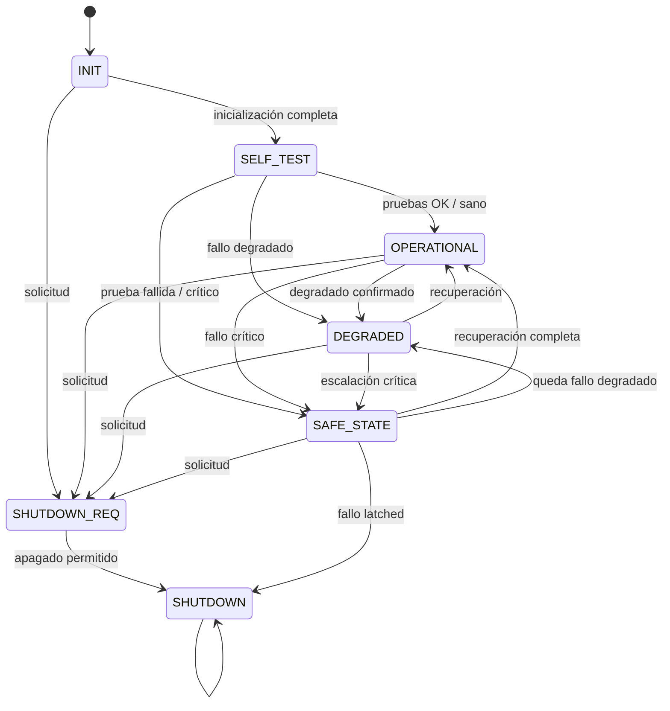
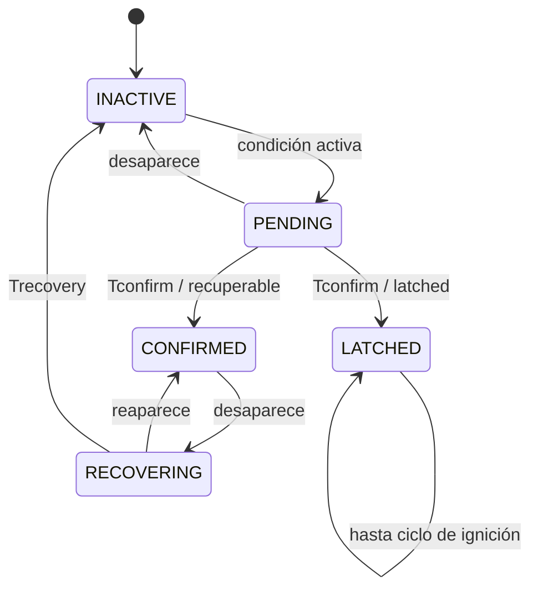

# myECU

Prototipo educativo de una ECU automotriz en C++11 con CORE portable,
simulador Linux y una primera plataforma bare-metal STM32.

Implementa una máquina de estados a nivel de sistema, supervisión configurable
de señales, confirmación temporal de fallos y separación entre lógica de ECU y
dependencias de plataforma.

Actualmente el mismo CORE se compila y ejecuta tanto en host como sobre un
STM32F103C8T6.

> Estado: prototipo funcional educativo. No es software homologado ni debe
> instalarse en un vehículo.


## Arquitectura implementada

Plataformas
├── Linux / simulator
└── STM32 / bare-metal

MAX_SENSOR_COUNT ya es configurable por build

Flujo de cada ciclo:

```text
señales → SignalSample → SignalStore → reglas → FaultManager
        → FaultSummary + DiagnosticStatus → Control → EcuState
```

`Control` no conoce sensores concretos, rangos físicos ni mensajes. Consume
entradas genéricas. Las diferencias entre señales se expresan mediante reglas,
no mediante un `switch` por sensor en el CORE.

Documentación detallada:

- [Arquitectura y componentes](docs/ARCHITECTURE.md)
- [Máquinas de estados y transiciones](docs/FSM.md)
- [Simulaciones](docs/SIMULATION.md)
- [Compilación y pruebas](docs/TESTING.md)
- [Estado y próximos pasos](docs/ROADMAP.md)

## Estados de la ECU



Los estados son `INIT`, `SELF_TEST`, `OPERATIONAL`, `DEGRADED`, `SAFE_STATE`,
`SHUTDOWN_REQ` y `SHUTDOWN`. Ante diagnósticos no disponibles o errores internos
la política es fail-safe.

## Supervisión de fallos

Cada `EvaluationRule` identifica una señal mediante `SignalId` y define:

- evaluación `RANGE` o `TIMEOUT`;
- umbrales o edad máxima;
- tiempos de confirmación y recuperación;
- error, severidad y tipo de fallo;
- política `RECOVERABLE` o `LATCHED`.



`FaultManager` entrega un `FaultSummary` con fallo crítico activo, crítico
latched, degradado y cantidad total de fallos activos.

## Señales configuradas

Hay 10 señales y dos reglas por señal: rango y timeout.

| ID | Señal | Rango | Severidad de rango | Política |
|---:|---|---:|---|---|
| 100 | `SHUT_REQ` | 0–1 | Warning | Recuperable |
| 101 | `BRAKE` | 0–1 | Warning | Recuperable |
| 102 | `SPEED` | 0–220 km/h | Degraded | Recuperable |
| 103 | `RPM` | 0–7000 rpm | Critical | Recuperable |
| 104 | `TEMP` | -20–130 °C | Critical | Recuperable |
| 105 | `VOLTAGE` | 8–16 V | Critical | **Latched** |
| 106 | `TPS` | 0.5–4.8 V | Degraded | Recuperable |
| 107 | `MAP` | 0.5–4.7 V | Degraded | Recuperable |
| 108 | `MAF` | 2–120 g/s | Degraded | Recuperable |
| 109 | `O2` | 0.1–0.9 V | Degraded | Recuperable |

Las reglas confirman tras 200 ms y recuperan tras 500 ms. Los timeouts usan una
edad máxima de 500 ms.

## Memoria determinista

- `MAX_SENSOR_COUNT = 128`.
- Máximo de tres reglas por señal: 384 registros.
- Sin `new`, `delete`, `malloc` ni `free` en el CORE.

Medición orientativa en Linux x86-64 con GCC:

| Tipo | Tamaño |
|---|---:|
| `SignalSample` | 32 bytes |
| `FaultRecord` | 16 bytes |
| `EvaluationRule` | 56 bytes |
| `SignalStore` | 4,104 bytes |
| `FaultManager` | 6,184 bytes |
| `Control` | 1 byte |
| `EcuStateInputs` | 12 bytes |

`SignalStore + FaultManager` ocupan aproximadamente 10.1 KiB en el host. El
tamaño final debe medirse con el compilador y ABI del MCU.

## Compilación rápida

Requisitos: GCC o Clang con C++11, CMake 3.16+ o GNU Make.

```bash
make
./ecu
./ecu -auto
make test
```

Con CMake:

```bash
cmake -S . -B build-cmake -DCMAKE_BUILD_TYPE=Debug
cmake --build build-cmake
ctest --test-dir build-cmake --output-on-failure
./build-cmake/ecu_simulator -auto
```

Perfil embebido:

```bash
cmake -S . -B build-embedded \
  -DBUILD_ECU_SIMULATOR=OFF \
  -DECU_CORE_EMBEDDED_PROFILE=ON
cmake --build build-embedded
ctest --test-dir build-embedded --output-on-failure
```

El perfil usa un subconjunto freestanding sin excepciones ni RTTI y compila
cada header público aisladamente para detectar dependencias accidentales.

## Simulación automática

```bash
./ecu -auto
```

Las señales analógicas evolucionan gradualmente desde su valor anterior. Cada
tipo tiene tendencia, ruido y límites propios; temperatura y voltaje no saltan
entre extremos en un ciclo.

- `B`/`b`: activa o libera el freno.
- `S`/`s`: solicita apagado.

La solicitud lleva a `SHUTDOWN_REQ`. El apagado normal termina cuando el freno
está activo (`shutdownPermitted`), por lo que la secuencia habitual es `S` y
después `B`. Un fallo crítico `LATCHED` puede apagar directamente desde
`SAFE_STATE`, según la FSM objetivo.

## Límites

No incluye drivers CAN/LIN/SENT/ADC, RTOS, watchdog, DTC persistentes, UDS,
análisis WCET, concurrencia con ISR, HIL, cobertura MC/DC, MISRA C++ ni un
proceso ISO 26262. La portabilidad definitiva debe verificarse sobre el MCU.

## Licencia

[MIT](LICENSE)
