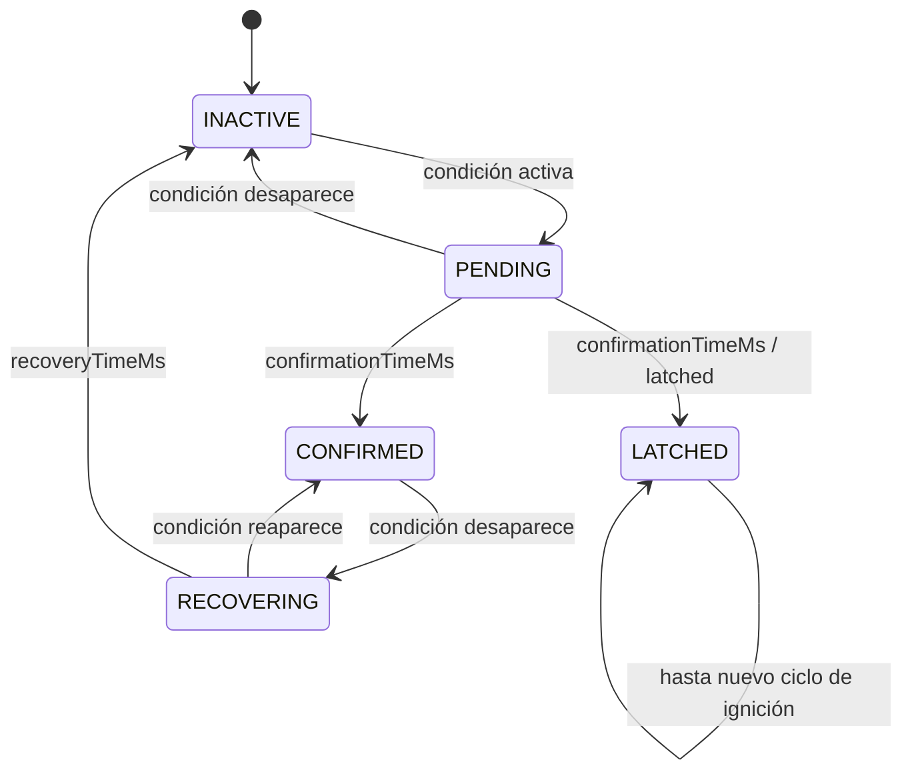

# myECU

Prototipo educativo de una ECU automotriz escrito en C++11. El proyecto
combina un CORE independiente de plataforma, un simulador para Linux y una
implementación bare-metal para STM32F103C8T6.

Incluye supervisión configurable de señales, diagnóstico temporal de fallos y
una máquina de estados global con modos `INIT`, `SELF_TEST`, `OPERATIONAL`,
`DEGRADED`, `SAFE_STATE`, `SHUTDOWN_REQ` y `SHUTDOWN`.

> **Aviso:** es un proyecto educativo. No es software homologado y no debe
> instalarse en un vehículo.


## Estado actual

- El CORE compila como C++11 en host y con el toolchain ARM Cortex-M3.
- El simulador Linux compila mediante Make y CMake.
- Los headers públicos del CORE se comprueban individualmente con CMake.
- El perfil embedded compila sin excepciones, RTTI ni asignación dinámica.
- Hay 12 ejecutables de prueba actualizados para el pipeline vigente.
- La aplicación STM32 utiliza el mismo pipeline funcional que el simulador.
- `control_test` fue compilado, grabado y verificado en un STM32F103 mediante
  ST-Link.
- La adquisición física actual utiliza ADC1 para TPS, temperatura NTC y MAP.

La purga arquitectónica y la validación física completa continúan en progreso.
En particular, quedan pendientes una validación exhaustiva de entradas
analógicas, comportamiento temporal y escenarios de fallo sobre hardware.

## Arquitectura

El código está separado por responsabilidad:

```text
core/             lógica portable de dominio
src/              simulador, configuración y soporte de host
include/          interfaces externas al CORE y soporte de simulación
app/stm32/        aplicación y adquisición para STM32
platform/stm32/   startup, linker y drivers bare-metal
tests/            pruebas ejecutables independientes
scripts/          compilación, pruebas y flasheo
docs/             arquitectura y sesiones de validación
```

El pipeline funcional común es:

```text
adquisición / simulación
          |
          v
MessageManager → Message → Gateway → SignalStatus
                                  |
                                  v
                    Control → FaultManager
                       |             |
                       v             v
                EcuStateMachine  FaultStateMachine
                       |
                       v
                    EcuState
```

Responsabilidades principales:

- `SystemConfig` es la fuente autoritativa de identidad, límites, timeout,
  severidad, confirmación, recuperación y latching.
- `MessageManager` crea y actualiza mensajes a partir de la configuración.
- `Gateway` es la única autoridad que evalúa rango y timeout.
- `EvaluationRule` conserva la política temporal derivada de `SystemConfig`.
- `FaultStateMachine` gestiona confirmación, recuperación y latching.
- `FaultManager` mantiene un registro de fault por señal y produce
  `FaultSummary`.
- `Control` transforma los estados de señal en condiciones diagnósticas y
  coordina la FSM global.
- `EcuStateMachine` decide el estado global usando exclusivamente entradas de
  dominio.

El CORE no conoce Linux, STM32, ADC, GPIO, consola ni APIs del sistema
operativo. El tiempo entra explícitamente como `TimestampMs`.

## Diagnóstico

`Gateway` asigna uno de estos estados a cada señal:

- `VALID`
- `OUT_OF_RANGE`
- `TIMEOUT`
- `UNDEFINED`

`OUT_OF_RANGE` y `TIMEOUT` son condiciones de una misma señal, no faults
paralelos. `FaultManager` entrega la condición ya evaluada a la máquina de
estados del fault:



La FSM global aplica una política fail-safe: errores internos, fallos críticos
y self-test fallido conducen a `SAFE_STATE` según el estado actual.

## Señales configuradas

La configuración actual contiene diez señales y un registro diagnóstico por
señal:

| ID | Señal | Rango | Severidad | Política |
|---:|---|---:|---|---|
| 100 | Solicitud de apagado | 0–1 | Warning | Recuperable |
| 101 | Permiso de apagado/freno | 0–1 | Warning | Recuperable |
| 102 | Velocidad | 0–220 km/h | Degraded | Recuperable |
| 103 | RPM | 0–7000 rpm | Critical | Recuperable |
| 104 | Temperatura | -20–30 °C | Critical | Recuperable |
| 105 | Voltaje | 8–16 V | Critical | Latched |
| 106 | TPS | 0.5–4.8 V | Degraded | Recuperable |
| 107 | MAP | 0.5–4.7 V | Degraded | Recuperable |
| 108 | MAF | 2–120 g/s | Degraded | Recuperable |
| 109 | Oxígeno | 0.1–0.9 V | Degraded | Recuperable |

Todas usan actualmente:

- timeout: 500 ms;
- confirmación: 200 ms;
- recuperación: 500 ms.

## Compilar el simulador

Requisitos para host:

- GCC o Clang con C++11;
- GNU Make o CMake 3.16+.

Con Make:

```bash
make
./ecu
./ecu -auto
```

También están disponibles:

```bash
make core
make sanitize
make clean
```

Con CMake:

```bash
cmake -S . -B build-cmake -DCMAKE_BUILD_TYPE=Debug
cmake --build build-cmake
./build-cmake/ecu_simulator
./build-cmake/ecu_simulator -auto
```

Para compilar únicamente el CORE con el perfil embedded:

```bash
cmake -S . -B build-embedded \
  -DBUILD_ECU_SIMULATOR=OFF \
  -DECU_CORE_EMBEDDED_PROFILE=ON
cmake --build build-embedded
```

## Ejecutar las pruebas

Las pruebas no están integradas actualmente en Make ni CMake. Se compilan y
ejecutan mediante el script dedicado:

```bash
./scripts/run_tests.sh
```

Para utilizar otro compilador:

```bash
CXX=clang++ ./scripts/run_tests.sh
```

El script genera los ejecutables en `build-tests/`, un directorio ignorado por
Git. La suite actual cubre:

- tipos e identidades de dominio;
- `Message`, `Gateway` y límites de rango;
- configuración derivada;
- confirmación, recuperación y latching;
- `FaultManager` y `DiagnosticStatus`;
- transiciones de la FSM global;
- pipeline completo de consola;
- simulación de sensores;
- comportamiento de `SignalStore`, que permanece fuera del pipeline oficial.

## Simulación automática

```bash
./ecu -auto
```

Las señales analógicas evolucionan gradualmente. Durante la simulación:

- `B`/`b` activa o libera el permiso de apagado/freno;
- `S`/`s` activa o libera la solicitud de apagado.

Una solicitud lleva a `SHUTDOWN_REQ`. El apagado normal alcanza `SHUTDOWN`
cuando también existe permiso.

## STM32F103C8T6

La plataforma bare-metal incluye:

- startup y tabla de vectores;
- linker script para STM32F103C8T6;
- contador de milisegundos mediante SysTick;
- control de LEDs en GPIOB;
- ADC1 para los canales 0, 1 y 2;
- conversión de TPS a voltaje;
- estimación de temperatura mediante divisor NTC;
- visualización del estado de la ECU mediante LEDs.

El firmware de prueba mantiene valores nominales para las siete señales que
todavía no tienen adquisición física. TPS, temperatura y MAP entran por el
mismo contrato `Message` utilizado por el simulador:

| Señal | Entrada STM32 | Tratamiento |
|---|---|---|
| TPS (`106`) | PA0 / ADC1_IN0 | ADC a voltaje |
| Temperatura (`104`) | PA1 / ADC1_IN1 | divisor NTC y modelo Beta |
| MAP (`107`) | PA2 / ADC1_IN2 | ADC a voltaje |

Una lectura NTC eléctricamente inválida (`ADC <= 100` o `ADC >= 4000`) no
actualiza el mensaje; el timeout del CORE termina detectando la ausencia de
una muestra válida. TPS y MAP se actualizan en cada ciclo de adquisición.

El ciclo STM32 se ejecuta cada 100 ms. Los fallos actuales se confirman tras
200 ms y los recuperables regresan a inactivos después de 500 ms continuos sin
la condición de fallo.

### LEDs de estado

| Estado ECU | LED externo | Pin |
|---|---|---|
| `INIT` / `SELF_TEST` | Azul | PB8 |
| `OPERATIONAL` | Verde | PB5 |
| `DEGRADED` | Amarillo | PB6 |
| `SAFE_STATE` | Rojo | PB7 |
| `SHUTDOWN_REQ` / `SHUTDOWN` | Apagados | — |

Los GPIO son activos en alto y cada LED requiere una resistencia limitadora,
usada actualmente con un valor de 220 Ω. Las entradas analógicas deben
permanecer entre 0 y 3.3 V, aunque algunos límites lógicos configurados sean
superiores.

### Compilar y flashear `control_test`

Requisitos:

- `arm-none-eabi-g++`;
- `arm-none-eabi-objcopy`;
- `arm-none-eabi-size`;
- `st-flash` de stlink-tools;
- ST-Link conectado al MCU.

```bash
./scripts/stm32_control_test.sh
```

El script:

1. compila el CORE y la aplicación para Cortex-M3;
2. genera `build-stm32/control_test.elf`, `.bin` y `.map`;
3. muestra el tamaño del firmware;
4. escribe el binario en `0x08000000`;
5. solicita reset y verifica la escritura.

La configuración STM32 usa `MYECU_MAX_SENSOR_COUNT=16` para reducir memoria.
El último firmware verificado ocupó aproximadamente 5.8 KiB de flash y 20
bytes de BSS; estas cifras pueden cambiar con el código y el toolchain.

También existe una prueba independiente de LEDs:

```bash
./scripts/stm32_led_test.sh
```

## Memoria y portabilidad

El CORE utiliza almacenamiento de capacidad fija mediante `std::array` y no
usa `new`, `delete`, `malloc` ni `free`.

- Capacidad predeterminada en host: `MAX_SENSOR_COUNT=128`.
- Capacidad utilizada por el script STM32: `MAX_SENSOR_COUNT=16`.
- Estándar mínimo: C++11.
- El CORE compila con `-ffreestanding`, `-fno-exceptions`, `-fno-rtti`,
  `-fno-threadsafe-statics` y `-fno-use-cxa-atexit`.

## Limitaciones actuales

- No hay drivers CAN, LIN o SENT.
- No hay RTOS, watchdog ni persistencia de DTC.
- No hay UDS ni bootloader de actualización.
- No se ha realizado análisis WCET, cobertura MC/DC ni conformidad MISRA C++.
- No existe un proceso ISO 26262.
- Las constantes del circuito NTC son provisionales y requieren calibración.
- La integración analógica y los estados de fallo necesitan más validación
  física sobre la placa.
- `SignalStore` permanece en el repositorio para pruebas y auditoría, pero no
  pertenece al pipeline productivo vigente.

## Documentación

- [Arquitectura](docs/ARCHITECTURE.md)
- [FSM](docs/FSM.md)
- [Simulación](docs/SIMULATION.md)
- [Pruebas](docs/TESTING.md)
- [Validación STM32](docs/STM32_VALIDATION.md)
- [Sesión de entrada analógica](docs/ANALOG_INPUT_SESSION.md)
- [Roadmap](docs/ROADMAP.md)

## Licencia

[MIT](LICENSE)
