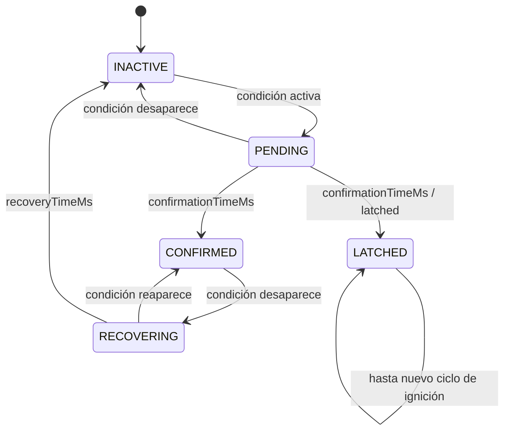
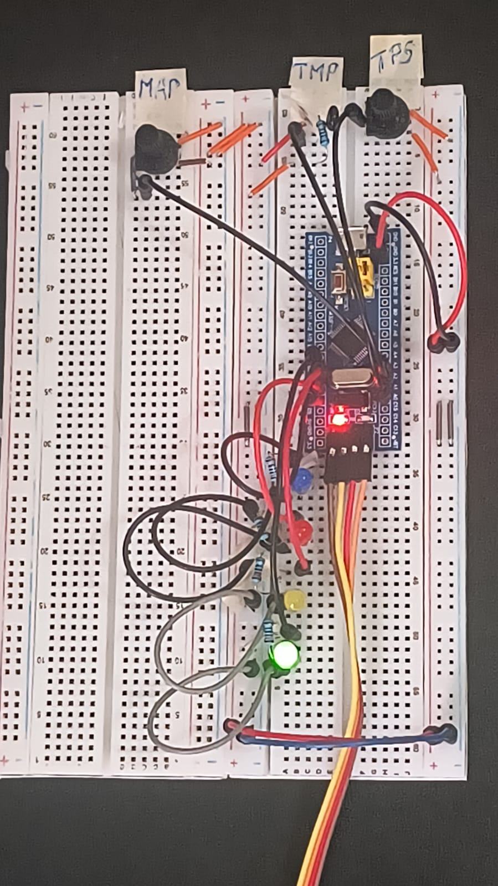
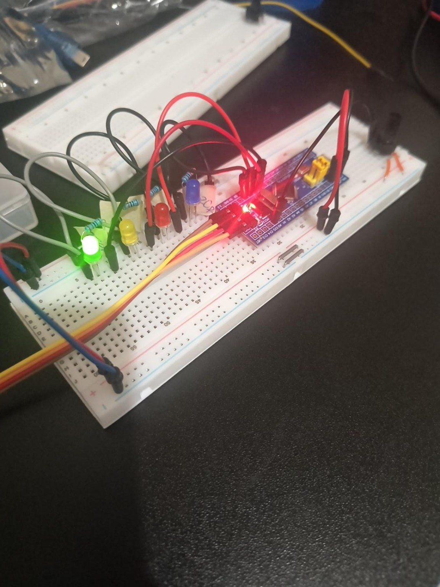
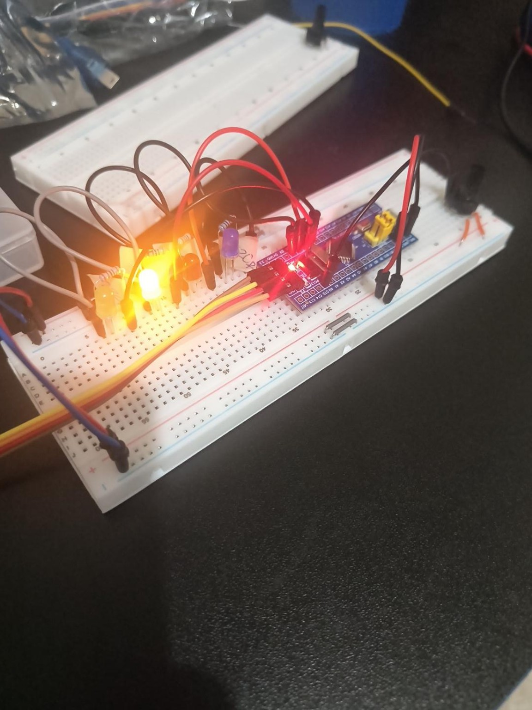

# myECU

Prototipo educativo de una ECU automotriz escrito en C++11. El proyecto
combina un CORE independiente de plataforma, un simulador para Linux y una
implementación bare-metal para STM32F103C8T6.

Incluye supervisión configurable de señales, diagnóstico temporal de fallos y
una máquina de estados global con modos `INIT`, `SELF_TEST`, `OPERATIONAL`,
`DEGRADED`, `SAFE_STATE`, `SHUTDOWN_REQ` y `SHUTDOWN`.

> **Aviso:** es un proyecto educativo. No es software homologado y no debe
> instalarse en un vehículo.


## Alcance: del hito de C++ al prototipo embebido

El punto de partida es **Hito Rango IV — ECU Gateway + ECU de Control**:
POO, STL, CMake, señales simuladas, validación y máquina de estados. myECU
amplía ese alcance con un núcleo portable ejecutado en **STM32F103C8T6 real**,
drivers bare-metal, entradas ADC, depuración SWD y salidas físicas por LEDs.

El avance adicional se apoya en mediciones y registros experimentales:
un potenciómetro usado como entrada TPS, conversión ADC, diagnóstico,
recuperación y cambios observables del estado de la ECU. La implementación
incluye además adquisición NTC y MAP y trabajo en curso sobre captura de RPM.
La evidencia histórica de hardware y el estado del código actual se distinguen
más abajo; no todas las entradas tienen el mismo grado de validación.

## Correspondencia con Hito Rango IV

Referencia: `Hito_rango_IV-1-45.pdf`, diapositivas 1–45 del material facilitado
(el documento está numerado sobre 52). El PDF no está incluido en este
repositorio. La tabla describe la implementación, no una calificación oficial.

| Requisito / diapositivas | Correspondencia en myECU | Estado y alcance |
|---|---|---|
| Gateway y Control separados, 4–7 | `Gateway` valida; `Control`, `FaultManager` y las FSM deciden el estado | Separación funcional implementada; Gateway no ejecuta la FSM |
| Recibir y almacenar señales, 4 y 21 | `MessageManager` y `std::array<Message, MAX_SENSOR_COUNT>` | Implementado mediante componentes separados; `Gateway` no es dueño del almacenamiento |
| Velocidad, RPM, temperatura, batería y aceite, 8 | `src/config.cpp` y `src/sensor_simulation.cpp` | Las cinco obligatorias están presentes; once señales en total |
| Validez por rango, 9–10 | `Gateway::validateMessage()` y `SignalStatus` | Límites inclusivos; distingue fuera de rango de timeout |
| Supervisión temporal sin eliminar señales, 11–20 | Timestamp y timeout por mensaje | El último valor permanece almacenado; cambia su estado al vencer |
| Uso de STL, 22–23 | `std::array`, `std::mt19937` y distribuciones aleatorias | Capacidad fija apropiada para MCU; los algoritmos `find_if`/`count_if` del PDF son ejemplos, no se usan actualmente |
| Control y estados mínimos, 24–30 | `Control`, `FaultManager`, `EcuStateMachine` | Los cuatro estados requeridos y tres adicionales; diagnóstico temporal configurable |
| Simulación automática relacionada, 32 | `randomSimulation()` y `simulateSensorValue()` | Evolución gradual y ruido implementados; relación TPS → RPM → velocidad pendiente |
| Generador aleatorio, 33 | `src/utils.cpp`, `mt19937` y distribuciones uniformes | Implementado; usa `random_device`, sin semilla fija para repetir escenarios |
| Fallos de rango y falta de actualización, 34 | Ventanas de fallos en `randomSimulation()` | Ambos tipos implementados durante 20 ciclos por ventana |
| Dashboard, 35–36 | `printMessages()` y `printControlState()` | Consola con valores, unidades, validez y estado global separados |
| Componentes equivalentes / POO, 37–40 | Tabla de componentes siguiente | Equivalencia funcional; simulador y dashboard siguen como funciones, no clases independientes |
| `main` coordinador, 39–40 | `main.cpp` configura y delega | Validación, diagnóstico, FSM y presentación están fuera de `main` |
| CMake, 41–42 | `CMakeLists.txt`, biblioteca `ecu_core` y simulador | Compilación host verificada; comprobación aislada de headers adicional |
| README y entregables, 43–45 | Fuentes, headers, Make, CMake, scripts y esta documentación | Instrucciones y evidencias incluidas; integrante identificado más abajo |

### Componentes equivalentes

| Componente del hito | Implementación actual |
|---|---|
| `Sensor` | `Message` + metadatos de `SystemConfig` |
| `VehicleSimulator` | `randomSimulation()` + `simulateSensorValue()` |
| `ECUGateway` | `MessageManager` + array de mensajes + `Gateway` |
| `ECUControl` | `Control` + `FaultManager` + máquinas de estados |
| `Dashboard` | `printMessages()` + `printControlState()` |

Usar milisegundos en lugar de ciclos conserva el objetivo de supervisión
temporal. Usar `std::array` en lugar del `vector` propuesto como ejemplo
permite almacenamiento fijo y evita asignaciones dinámicas en el núcleo.
Estos cambios son decisiones de arquitectura. La relación entre señales y
la separación del simulador/dashboard en clases siguen siendo pendientes
respecto del alcance funcional y de POO descrito en el hito.

**Integrante:** JESUS CARLOS CARDENAS.

## Estado actual

- El CORE compila como C++11 en host y con el toolchain ARM Cortex-M3.
- El simulador Linux compila mediante Make y CMake.
- Los headers públicos del CORE se comprueban individualmente con CMake.
- El perfil embedded compila sin excepciones, RTTI ni asignación dinámica.
- Hay 12 ejecutables de prueba actualizados para el pipeline vigente.
- La aplicación STM32 utiliza el mismo pipeline funcional que el simulador.
- `control_test` fue compilado, grabado y verificado en un STM32F103 mediante
  ST-Link.
- La adquisición física actual utiliza ADC1 para TPS, temperatura NTC y MAP.
- El modo automático guarda transiciones y fallos activos en TXT o muestras
  por ciclo en CSV mediante `Logger`, sin introducir dependencias en el CORE.

La revisión arquitectónica y la validación física completa continúan en progreso.
En particular, quedan pendientes una validación exhaustiva de entradas
analógicas, comportamiento temporal y escenarios de fallo sobre hardware.

## Arquitectura

El código está separado por responsabilidad:

```text
core/             lógica portable de dominio
src/              simulador, configuración y soporte de host
include/          interfaces externas al CORE y soporte de simulación
app/stm32/        aplicación y adquisición para STM32
platform/stm32/   startup, linker y drivers bare-metal
tests/            pruebas ejecutables independientes
scripts/          compilación, pruebas y flasheo
docs/             arquitectura y sesiones de validación
```

El pipeline funcional común es:

```text
adquisición / simulación
          |
          v
MessageManager → Message → Gateway → SignalStatus
                                  |
                                  v
                    Control → FaultManager
                       |             |
                       v             v
                EcuStateMachine  FaultStateMachine
                       |
                       v
                    EcuState
```

Responsabilidades principales:

- `SystemConfig` es la fuente autoritativa de identidad, límites, timeout,
  severidad, confirmación, recuperación y latching.
- `MessageManager` crea y actualiza mensajes a partir de la configuración.
- `Gateway` es la única autoridad que evalúa rango y timeout.
- `EvaluationRule` conserva la política temporal derivada de `SystemConfig`.
- `FaultStateMachine` gestiona confirmación, recuperación y latching.
- `FaultManager` mantiene un registro de fault por señal y produce
  `FaultSummary`.
- `Control` transforma los estados de señal en condiciones diagnósticas y
  coordina la FSM global.
- `EcuStateMachine` decide el estado global usando exclusivamente entradas de
  dominio.

El CORE no conoce Linux, STM32, ADC, GPIO, consola ni APIs del sistema
operativo. El tiempo entra explícitamente como `TimestampMs`.

## Diagnóstico

`Gateway` asigna uno de estos estados a cada señal:

- `VALID`
- `OUT_OF_RANGE`
- `TIMEOUT`
- `UNDEFINED`

`OUT_OF_RANGE` y `TIMEOUT` son condiciones de una misma señal, no faults
paralelos. `FaultManager` entrega la condición ya evaluada a la máquina de
estados del fault:


```mermaid
stateDiagram-v2
    [*] --> INACTIVE
    INACTIVE --> PENDING: condición activa
    PENDING --> INACTIVE: condición desaparece
    PENDING --> CONFIRMED: confirmationTimeMs
    PENDING --> LATCHED: confirmationTimeMs / latched
    CONFIRMED --> RECOVERING: condición desaparece
    RECOVERING --> CONFIRMED: condición reaparece
    RECOVERING --> INACTIVE: recoveryTimeMs
    LATCHED --> LATCHED: hasta nuevo ciclo de ignición
```

La FSM global aplica una política fail-safe: errores internos, fallos críticos
y self-test fallido conducen a `SAFE_STATE` según el estado actual.

## Señales configuradas

La configuración actual contiene once señales y un registro diagnóstico por
señal:

| ID | Señal | Rango | Severidad | Política |
|---:|---|---:|---|---|
| 100 | Solicitud de apagado | 0–1 | Warning | Recuperable |
| 101 | Permiso de apagado/freno | 0–1 | Warning | Recuperable |
| 102 | Velocidad | 0–220 km/h | Degraded | Recuperable |
| 103 | RPM | 0–7000 rpm | Critical | Recuperable |
| 104 | Temperatura | -20–130 °C | Critical | Recuperable |
| 105 | Voltaje | 8–16 V | Critical | Latched |
| 106 | TPS | 0.5–4.8 V | Degraded | Recuperable |
| 107 | MAP | 0.5–4.7 V | Degraded | Recuperable |
| 108 | MAF | 2–120 g/s | Degraded | Recuperable |
| 109 | Oxígeno | 0.1–0.9 V | Degraded | Recuperable |
| 110 | Presión de aceite | 1–6 bar | Critical | Recuperable |

Todas usan actualmente:

- timeout: 500 ms;
- confirmación: 200 ms;
- recuperación: 500 ms.

La política del prototipo distingue señales críticas (RPM, temperatura,
batería y aceite) de señales cuya falla permite operación degradada
(velocidad, TPS, MAP, MAF y oxígeno). Solicitud y permiso de apagado tienen
severidad warning. Son decisiones educativas configurables, no límites
calibrados para un vehículo concreto.

El rango se comprueba con extremos inclusivos. Una señal vence cuando su edad
es **mayor que 500 ms**. Confirmación y recuperación son intervalos mínimos:
la transición se observa en la siguiente evaluación. En Linux el ciclo nominal
es de 500 ms; en STM32, de 100 ms. Por tanto, no debe esperarse resolución de
200 ms en la consola aunque ese sea el umbral de confirmación.

`SELF_TEST` añade una etapa de arranque (actualmente `Control` entrega el
resultado `PASSED`); `SHUTDOWN_REQ` espera permiso y `SHUTDOWN` es terminal.
Los fallos críticos recuperables permiten regresar tras recuperación; el
voltaje utiliza latching y puede llevar de `SAFE_STATE` a `SHUTDOWN`.

## Compilar el simulador

Ejecutar los comandos desde la raíz del repositorio, en Linux.

Requisitos para host:

- GCC o Clang con C++11;
- GNU Make para el Makefile;
- CMake 3.16+ y una herramienta de construcción compatible (Make o Ninja) para CMake;
- Bash para los scripts de pruebas y STM32.

Con Make:

```bash
make
./ecu
./ecu -auto
```

También están disponibles:

```bash
make core
make sanitize
make clean
```

Con CMake:

```bash
cmake -S . -B build-cmake -DCMAKE_BUILD_TYPE=Debug
cmake --build build-cmake
./ecu
./ecu -auto
```

Ambos métodos producen `./ecu` y `build/libecu_core.a`. CMake conserva sus
objetos, caché y comprobaciones de headers dentro de `build-cmake/`; el target
del ejecutable continúa llamándose `ecu_simulator`.

```bash
# Solo el núcleo
cmake --build build-cmake --target ecu_core

# Limpiar productos generados por CMake
cmake --build build-cmake --target clean

# Limpiar y recompilar
cmake --build build-cmake --clean-first
```

Make y CMake comparten las salidas finales. Al cambiar de método o perfil,
recompilar desde limpio con el método elegido para evitar reutilizar una
salida del otro. `make clean` no limpia los objetos internos de CMake.

Para compilar únicamente el CORE con el perfil embedded:

```bash
cmake -S . -B build-embedded \
  -DBUILD_ECU_SIMULATOR=OFF \
  -DECU_CORE_EMBEDDED_PROFILE=ON
cmake --build build-embedded
```

Este perfil comprueba restricciones de compilación del núcleo usando el
compilador configurado. **No genera por sí mismo firmware STM32 ni configura
un toolchain ARM**; el firmware se construye con los scripts de la sección STM32.
La biblioteca de este perfil también se escribe en `build/libecu_core.a`.

Los directorios generados y `ecu` están ignorados por Git. Tras clonar bastan
los fuentes, headers y archivos de construcción versionados para regenerarlos.

## Ejecutar las pruebas

Las pruebas no están integradas actualmente en Make ni CMake. Se compilan y
ejecutan mediante el script dedicado:

```bash
./scripts/run_tests.sh
```

Para utilizar otro compilador:

```bash
CXX=clang++ ./scripts/run_tests.sh
```

El script genera los ejecutables en `build-tests/`, un directorio ignorado por
Git. La suite actual cubre:

- tipos e identidades de dominio;
- `Message`, `Gateway` y límites de rango;
- configuración derivada;
- confirmación, recuperación y latching;
- `FaultManager` y `DiagnosticStatus`;
- transiciones de la FSM global;
- integración del pipeline de mensajes, diagnóstico y control;
- simulación de sensores;
- comportamiento de `SignalStore`, que permanece fuera del pipeline oficial.

También se puede repetir un ejecutable ya construido:

```bash
./build-tests/gateway_tests
./build-tests/ecu_integration_tests
```

Se verificaron los 12 ejecutables de la suite en host. Esto no equivale a
validación física de STM32 ni a pruebas de la interfaz de consola. Las pruebas
actuales tampoco cubren el logger, toda la integración RPM ni la duración de ventanas
dentro del bucle interactivo. `make sanitize` construye el simulador con
ASan/UBSan; no ejecuta automáticamente esta suite.

## Simulación manual y automática

```bash
./ecu
```

El modo manual permite introducir valores, consultar estados y salir con la
opción 3. Valida y procesa al completar la entrada de señales; no ejecuta un
ciclo continuo de supervisión mientras espera datos del usuario.

Para el modo automático:

```bash
./ecu -auto
```

Las señales analógicas evolucionan gradualmente. Durante la simulación:

- `B`/`b` activa o libera el permiso de apagado/freno;
- `S`/`s` activa la solicitud de apagado; no la alterna.

Una solicitud lleva a `SHUTDOWN_REQ`. El apagado normal alcanza `SHUTDOWN`
cuando también existe permiso.

La primera selección aleatoria de fallos ocurre tras 30 ciclos (unos 15 s).
En cada selección, cada señal analógica no enclavada tiene una probabilidad de falla del
50 % y, si se selecciona, un 50 % de probabilidad de timeout frente a fuera
de rango. El tipo se mantiene durante 20 ciclos (unos 10 s); quedan 10 ciclos
(unos 5 s) sin inyección antes de la siguiente selección.

El modo automático ofrece dos formatos de registro:

```bash
./ecu -auto       # eventos en logs/txt/<timestamp>.txt
./ecu -auto -csv  # muestras por ciclo en logs/csv/<timestamp>.csv
```

TXT registra cada cambio de `EcuState` y, al entrar en `DEGRADED` o
`SAFE_STATE`, los fallos en `CONFIRMED`, `RECOVERING` o `LATCHED` con su
último valor. CSV incluye una cabecera con nombres y unidades y una fila por
ciclo con todos los valores a cuatro decimales y `ECU_STATE`; no incluye
columna temporal ni diagnóstico individual de las señales. En timeout puede
mostrar la última muestra almacenada.

Las carpetas se crean respecto al directorio de trabajo. Cada ejecución usa
un nombre basado en el reloj monotónico, no en la fecha/hora de calendario;
la apertura sigue siendo append, por lo que una coincidencia de nombres
agregaría datos al archivo existente. Git ignora `logs/`. El modo manual no
genera registros. Consulte [Registro de eventos](docs/LOGGING.md) para el
formato, la interfaz y las limitaciones.

En timeout no se actualiza el mensaje; en rango se escribe `maxValue + 1`.
Al terminar la ventana se retoma la evolución normal y el diagnóstico aplica
su recuperación. Los tiempos son aproximados y dependen del ciclo de consola.
La selección aleatoria excluye sensores `LATCHED`, actualmente Voltaje.
El diagnóstico enclavado sigue vigente y puede observarse mediante inyección
manual; no se fuerza su recuperación.

## STM32F103C8T6

La plataforma bare-metal incluye:

- startup y tabla de vectores;
- linker script para STM32F103C8T6;
- contador de milisegundos mediante SysTick;
- control de LEDs en GPIOB;
- ADC1 para los canales 0, 1 y 2;
- conversión de TPS a voltaje;
- estimación de temperatura mediante divisor NTC;
- visualización del estado de la ECU mediante LEDs.

El firmware de prueba combina adquisición física con valores nominales.
Actualmente renueva ocho señales por software, incluida RPM; excluye TPS,
temperatura y MAP de esa renovación. TPS, temperatura y MAP entran por el
mismo contrato `Message` utilizado por el simulador:

| Señal | Entrada STM32 | Tratamiento |
|---|---|---|
| TPS (`106`) | PA0 / ADC1_IN0 | ADC a voltaje |
| Temperatura (`104`) | PA1 / ADC1_IN1 | divisor NTC y modelo Beta |
| MAP (`107`) | PA2 / ADC1_IN2 | ADC a voltaje |
| RPM (`103`) | PA6 / TIM3_CH1 | Captura de período y conversión a RPM; integración pendiente |

Una lectura NTC eléctricamente inválida (`ADC <= 100` o `ADC >= 4000`) no
actualiza el mensaje; el timeout del CORE termina detectando la ausencia de
una muestra válida. TPS y MAP se actualizan en cada ciclo de adquisición.

El ciclo STM32 se ejecuta cada 100 ms. Los fallos actuales se confirman tras
200 ms y los recuperables regresan a inactivos después de 500 ms continuos sin
la condición de fallo.

### Estado de la adquisición RPM

Existen el driver `platform/stm32/src/rpm_input.cpp`, el conversor
`app/stm32/rpm_sensor.cpp` y una aplicación independiente
`app/stm32/rpm_input_test.cpp`. La configuración provisional usa un pulso por
revolución y un máximo de 7000 RPM; el PPR real requiere validación.

La integración en `control_test` **todavía no está validada**:

- `refreshNominalSignals()` sigue renovando RPM a 3500 y puede ocultar la
  ausencia de pulsos y su timeout.
- El objeto global `RPM_SENSOR` requiere construcción dinámica, pero el startup
  actual no ejecuta los inicializadores C++; el mapa de enlace revisado descarta
  esa inicialización. Sus parámetros no quedan preparados para adquirir RPM.

La prueba RPM independiente crea el objeto dentro de `main` y compila, pero
eso no demuestra funcionamiento físico ni cierra la integración con `Control`.

### Aplicación principal STM32

`app/stm32/main.cpp` comparte el pipeline de mensajes, pero no es equivalente
al firmware de prueba: no llama a `initRpmInput()` ni renueva nominalmente las
señales aún no adquiridas. Con las once señales actuales, esas entradas vencen;
el timeout del voltaje crítico latched termina conduciendo a `SHUTDOWN`.
El script integrado construye `control_test.cpp`, no esta aplicación principal.

### LEDs de estado

| Estado ECU | LED externo | Pin |
|---|---|---|
| `INIT` / `SELF_TEST` | Azul | PB8 |
| `OPERATIONAL` | Verde | PB5 |
| `DEGRADED` | Amarillo | PB6 |
| `SAFE_STATE` | Rojo | PB7 |
| `SHUTDOWN_REQ` / `SHUTDOWN` | Apagados | — |

Los GPIO son activos en alto y cada LED requiere una resistencia limitadora,
usada actualmente con un valor de 220 Ω. Las entradas analógicas deben
permanecer entre 0 y 3.3 V, aunque algunos límites lógicos configurados sean
superiores.

### Compilar y flashear `control_test`

Requisitos:

- `arm-none-eabi-g++`;
- `arm-none-eabi-objcopy`;
- `arm-none-eabi-size`;
- `st-flash` de stlink-tools;
- ST-Link conectado al MCU.

```bash
./scripts/stm32_control_test.sh
```

El script:

1. compila el CORE y la aplicación para Cortex-M3;
2. genera `build-stm32/control_test.elf`, `.bin` y `.map`;
3. muestra el tamaño del firmware;
4. escribe el binario en `0x08000000`;
5. solicita reset y verifica la escritura.

Estos scripts **compilan y graban la placa**: no tienen una opción de solo
compilación. El firmware se ejecuta tras el reset; la observación es mediante
LEDs o GDB, no mediante `./control_test.elf` en Linux.

La configuración STM32 usa `MYECU_MAX_SENSOR_COUNT=16`. Una compilación del
código actual con el toolchain ARM de esta revisión produjo 8428 bytes de
`text`, 0 de `data` y 60 de `bss`. Estas cifras no incluyen pila ni constituyen
una medición de RAM máxima en ejecución. El ELF actual fue compilado; no se
volvió a grabar la placa durante esta revisión documental.

### Scripts y aplicaciones disponibles

| Comando / archivo | Propósito | Salidas y estado |
|---|---|---|
| `./scripts/run_tests.sh` | Compilar y ejecutar 12 pruebas host | `build-tests/`; no usa la placa |
| `./scripts/stm32_control_test.sh` | Construir y grabar la aplicación integrada | `build-stm32/control_test.{elf,bin,map}`; compilación verificada, RPM pendiente |
| `./scripts/stm32_rpm_input_test.sh` | Construir y grabar la prueba aislada de RPM | `build-stm32/rpm_input_test.{elf,bin,map}`; compilación verificada |
| `./scripts/stm32_led_test.sh` | Prueba histórica de LEDs | Actualmente falla el enlace: falta `TIM3_IRQHandler`, requerido por el startup compartido |
| `app/stm32/adc_test.cpp` | Prueba aislada de ADC | Fuente disponible; no hay script dedicado de construcción |

Para probar RPM por separado, con la placa conectada y la entrada de pulsos
adecuada en PA6:

```bash
./scripts/stm32_rpm_input_test.sh
```

Esta prueba reemplaza el firmware de control en la placa. Para regresar al
firmware integrado, ejecutar nuevamente `./scripts/stm32_control_test.sh`.

### Depuración con ST-Link y GDB

Se requieren además `st-util` y `gdb-multiarch`. Después de grabar
`control_test`, iniciar en una terminal:

```bash
st-util
```

En otra terminal:

```bash
gdb-multiarch build-stm32/control_test.elf
```

Dentro de GDB:

```gdb
target extended-remote :4242
continue
```

Interrumpir con Ctrl+C y consultar:

```gdb
print g_ecuState
print g_tpsVoltage
print g_tpsFaultState
print g_temperatureEstimatedC
print g_temperatureSignalStatus
print g_mapVoltage
print g_mapSignalStatus
print g_rpm
print g_rpmSignalStatus
print g_rpmFaultState
continue
```

Para la prueba RPM aislada, abrir su propio ELF:

```bash
gdb-multiarch build-stm32/rpm_input_test.elf
```

Después de conectar, ejecutar e interrumpir, consultar `g_rpmPeriodUs`,
`g_rpmPeriodCount`, `g_rpm`, `g_validRpmCount` y `g_rejectedRpmCount`.
Las variables pertenecen a cada aplicación; no todas existen en ambos ELF.
Detener el MCU con GDB altera el comportamiento temporal, por lo que no
sustituye una medición externa del ciclo.

## Evidencia experimental y alcance adicional

El hito exige una simulación y un dashboard. La extensión embebida añade
adquisición eléctrica real, ejecución del diagnóstico en MCU, depuración SWD
y señalización física del estado. La evidencia siguiente corresponde a las
sesiones registradas, no a una validación exhaustiva del firmware más reciente.

| Evidencia | Resultado documentado | Alcance |
|---|---|---|
| Potenciómetro B103 | Aproximadamente 10.5 kΩ entre extremos | Caracterización pasiva con multímetro |
| Entrada ADC en PA0 | 0.00 V → ADC 1; 3.28 V → ADC 4093 | Recorrido físico prácticamente completo del ADC de 12 bits |
| Diagnóstico TPS | `INACTIVE → CONFIRMED → INACTIVE` | Fallo mantenido y recuperación observados por GDB |
| Estado global y LEDs | `OPERATIONAL` verde; `DEGRADED` amarillo | Propagación de entrada física hasta estado observable |
| Temporización | SysTick de 1 ms y ciclo de aplicación cercano a 100 ms | Validación temporal preliminar documentada con analizador lógico |
| NTC y MAP | Adquisición implementada en PA1 y PA2 | Calibración y validación física completa pendientes |
| RPM | Driver, conversor y prueba independiente | Integración física con el control pendiente |

Fuentes: [validación STM32](docs/STM32_VALIDATION.md),
[sesión de caracterización analógica](docs/ANALOG_INPUT_SESSION.md),
[implementación Blue Pill](docs/BLUE_PILL_IMPLEMENTATION.md) y
[registro de pruebas](docs/TESTING.md).

### Montaje e indicación física



| Estado operacional | Estado degradado |
|---|---|
|  |  |

Las [capturas de instrumentación](docs/images/stm32/) complementan el registro
experimental. No representan mediciones de WCET ni una caracterización
estadística de jitter.

**Lectura de los registros históricos:** algunos documentos conservan el
pipeline anterior con `SignalSample`/`SignalStore`, diez señales y un límite
de temperatura de 30 °C. El código actual utiliza `Message → Gateway → Control`,
once señales y un máximo configurado de 130 °C. Las mediciones históricas
siguen siendo evidencia de esas sesiones; sus nombres de API, índices y
umbrales antiguos no deben copiarse como instrucciones del firmware actual.

## Memoria y portabilidad

El CORE utiliza almacenamiento de capacidad fija mediante `std::array` y no
usa `new`, `delete`, `malloc` ni `free`.

- Capacidad predeterminada en host: `MAX_SENSOR_COUNT=128`.
- Capacidad utilizada por el script STM32: `MAX_SENSOR_COUNT=16`.
- Estándar mínimo: C++11.
- El CORE compila con `-ffreestanding`, `-fno-exceptions`, `-fno-rtti`,
  `-fno-threadsafe-statics` y `-fno-use-cxa-atexit`.

## Complejidad algorítmica (Big O)

Análisis del código vigente, separado por componentes. Las cotas temporales
son de peor caso salvo donde se indica coste esperado/amortizado. Se cuentan
operaciones sobre tipos de tamaño fijo; no son mediciones de tiempo real.

### Variables y criterio de memoria

- `n`: señales o mensajes procesados en un ciclo.
- `r`: reglas diagnósticas; en la configuración derivada válida, `r = n`.
- `C`: capacidad reservada (`MAX_SENSOR_COUNT`): 128 en host y 16 en STM32.
- `a`: señales físicas buscadas durante adquisición; actualmente cuatro.
- `L`: longitud de una cadena; `B`: bytes de texto producidos en una operación.
- `k`: ciclos ejecutados; `D`: bytes de datos inicializados durante el arranque.
- `w`: iteraciones de espera de un periférico; `q`: bytes de `memset`.

Actualmente `n = r = 11`. Aunque una compilación concreta tiene capacidad
fija y todas las operaciones están acotadas por ella, se expresan las cotas en
función de `n`, `r` y `C` para mostrar cómo escala el diseño al añadir señales.

Las tablas distinguen memoria **auxiliar por operación** de almacenamiento
**reservado por objeto/aplicación**. Un recorrido puede usar O(1) memoria
auxiliar y operar sobre un array que ocupa O(C). Las referencias a memoria
excluyen buffers internos del sistema operativo y bibliotecas, salvo indicación.

### CORE (`core/`)

| Componente / operación | Tiempo | Memoria | Razón |
|---|---|---|---|
| Tipos de dominio (`SignalId`, `FaultRecord`, `FaultSummary`, enums) | O(1) por construcción, comparación o consulta | O(1) por objeto | Número fijo de campos |
| `SystemConfig` | O(C) al inicializar/copiar su array | O(C) reservado | Almacena capacidad completa, aunque solo `n` entradas estén activas |
| `Message` | O(1) por constructor, getter y setter | O(1) por mensaje; O(C) para el array | Campos de tamaño fijo |
| `MessageManager::InitMessage/UpdateMessage` | O(1) por mensaje; O(n) para un lote | O(1) auxiliar | Construcción/actualización directa, sin búsqueda |
| `Gateway::validateValue/validateMessage` | O(1) por señal; O(n) para un lote | O(1) auxiliar | Comparaciones de reloj, edad y rango |
| `EvaluationRule` y `DiagnosticStatus` | O(1) por construcción, validación o conversión | O(1) por objeto | Comprobaciones y switches de tamaño fijo |
| `FaultConfiguration::buildEvaluationRuleSet` | O(n²) | O(1) auxiliar; almacenamiento externo O(C) | Verifica duplicados con dos bucles y construye `n` reglas |
| `FaultConfiguration::validateEvaluationRuleSet` | O(n² + r² + nr); O(n²) con `r = n` | O(1) auxiliar | Comprueba duplicados y busca la configuración de cada regla linealmente |
| Constructor de `FaultManager` | O(C + r) | O(C) reservado | Inicializa todos los registros y valida las reglas; conserva un puntero a ellas |
| `FaultManager::processCondition/getRecord` | O(r) por señal | O(1) auxiliar | Búsqueda lineal por `SignalId`; encontrar la primera regla cuesta O(1) |
| `FaultManager::getSummary` | O(r) | O(1) auxiliar | Recorre registros y acumula un resumen de tamaño fijo |
| `FaultManager::reset/resetForIgnitionCycle` | O(r) | O(1) auxiliar | Reinicia los registros configurados |
| `FaultManager::getRuleCount/isConfigValid` | O(1) | O(1) auxiliar | Consulta directa |
| `FaultStateMachine::updateFaultRecord` | O(1) por fallo | O(1) auxiliar | Una transición mediante switch y comparaciones temporales |
| `EcuStateMachine::updateEcuState` | O(1) | O(1) auxiliar | Estados y entradas en cantidad fija |
| `Control::processMessages` | O(nr + n + r); O(n²) con `r = n` | O(1) auxiliar | Hasta `n` búsquedas de regla, un resumen y una transición global |
| Constructor, reset y consulta de estado de `Control` | O(1) | O(1) por objeto | Solo conserva el estado global |

Los retornos por configuración inválida o error pueden terminar antes; las
cotas describen el recorrido máximo válido. Construir los arrays de mensajes
y reglas agrega O(C) al arranque, fuera de las funciones que los reciben por
referencia. El CORE completo reserva O(C) memoria para configuración, mensajes,
reglas y registros; no crea un contenedor adicional en cada ciclo.

El coste cuadrático del control procede de **buscar la regla para cada
mensaje**, no de las FSM: procesar `n` transiciones de fallo ya localizadas
costaría O(n). Incluso con mensajes y reglas en el mismo orden, las búsquedas
actuales comienzan desde el índice cero: suman `1 + 2 + … + n` comparaciones.

### Simulación y presentación (`src/simulations.cpp`, `src/sensor_simulation.cpp`)

| Componente / operación | Tiempo | Memoria auxiliar | Razón |
|---|---|---|---|
| `initializeMessages` | O(n) | O(1) | Inicializa cada mensaje |
| `validateMessages` | O(n) | O(1) | Una validación constante por señal |
| Wrapper `processMessages` | O(nr + n + r) | O(1) | Delega en `Control` |
| `getSensorId`, `simulateSensorValue`, `evolveValue`, `clampValue` | O(1) por señal | O(1) | Switch y aritmética de tamaño fijo |
| `introduceFault` | O(1) por señal | O(1) | Omite actualización o escribe un valor fuera de rango |
| Selección de fallos y actualización de valores | O(n) por ciclo | O(1); array de fallos O(C) reservado | Un recorrido por señales en cada fase |
| `findSignalMetadata` | O(n) por búsqueda | O(1) | Busca identidad en la configuración |
| `printMessages` | O(n² + B) | O(1) | Busca metadatos para cada mensaje y emite `B` bytes |
| Textos/colores de estados | O(1) | O(1) | Devuelven literales mediante switches |
| `printControlState` | O(1) respecto a `n` | O(1) | Emite una cantidad fija de texto |
| `logFaultCauses` | O(nr + n + B) | O(1) | Busca un registro por señal; usa un buffer fijo de 256 bytes |
| `randomSimulation` | O(n² + nr + n + r + B) por ciclo | O(C + B) en CSV | Dashboard, actualización, control y registro TXT o CSV |
| `userSimulation`, opción 1 | O(n² + nr + n + r + B + Lentrada) | O(Lmáx) | Búsquedas por mensaje, construcción de prompts y conversión de entradas |
| `userSimulation`, opción 2 | O(n² + B) | O(1) | Dashboard; no procesa un nuevo ciclo diagnóstico |
| `userSimulation`, menú/salida | O(1), más texto descartado | O(1) | Operaciones fijas; `cin.ignore` puede recorrer hasta el fin de línea |

`Lentrada` es el total de caracteres numéricos leídos en una carga;
`Lmáx` es el tamaño máximo de strings temporales de entrada o prompt.
Para el logger, `B` incluye los caracteres examinados al formatear nombres y
unidades: un buffer de salida fijo no evita recorrer una cadena fuente larga.
Con los textos actuales de longitud acotada, `B = O(n)` por dashboard o listado
de causas y el coste automático por ciclo se simplifica a **O(n²)**.

En `k` ciclos, el trabajo automático es O(C + n + k·n²) bajo esas condiciones;
el almacenamiento de la aplicación es O(C + B) en CSV por la fila construida
en memoria; con textos y valores de longitud acotada, B = O(n) y n ≤ C. El bucle termina por
estado de apagado, no por un número fijo de iteraciones. Esperas de teclado,
terminal, disco y la pausa nominal de 500 ms se excluyen del conteo de operaciones.

### Logger y utilidades de host (`src/`, `include/`, `main.cpp`)

| Componente / operación | Tiempo | Memoria | Razón |
|---|---|---|---|
| `Logger`, constructor | O(1) | O(1) por objeto | Conserva un `FILE*` |
| `Logger::open` | Procesamiento de ruta O(L); E/S dependiente del SO | O(1) en la clase | Apertura en append; no recorre el contenido previo del log |
| `Logger::write` | O(L) de texto, más escritura/`fflush` | O(1) auxiliar propio | Emite el mensaje y una nueva línea |
| `Logger::close` y destructor | O(1) de lógica propia, más cierre/vaciado de E/S | O(1) auxiliar propio | Cierra el archivo, si está abierto |
| `get_timestamp_ms` | O(1) en el modelo de operaciones | O(1) | Consulta y conversión de reloj |
| `get_generator`, `randomFloat/randomInt` | O(1) esperado/amortizado por muestra | O(1) respecto a `n` | Estado de `mt19937` fijo; inicialización, renovación y rechazo dependen de la biblioteca |
| `isNumber` / conversión numérica | O(L) de procesamiento de texto | O(L) para el stream/string temporal | Examina la cadena de entrada |
| `detectKey`, `configureTerminal` | O(1) de lógica propia | O(1) | Lee como máximo un carácter o configura un número fijo de atributos |
| `cleanScreen` | O(1) de lógica propia; comando externo no acotado aquí | O(1) propio | Delega a `system("clear")` o `system("cls")` |
| `getSystemConfig` | O(C) | O(C) de configuración | Inicializa el array completo; once entradas explícitas |
| `isSystemConfigValid` | O(1) | O(1) | Compara conteo y capacidad |
| `main.cpp`, preparación | O(C + n² + r² + nr) | O(C) reservado | Inicializa arrays, deriva/valida reglas e inicializa el gestor |

Las distribuciones aleatorias pueden hacer intentos de rechazo; O(1) esperado
no es una garantía de peor tiempo real. Tampoco se deduce una cota de latencia
de `fopen`, `fprintf`, `fflush`, terminal o reloj a partir de Big O.

El archivo de log ocupa O(Btotal) **en disco**, donde `Btotal` es el total de
bytes escritos entre ejecuciones. El append no carga todo el archivo en RAM;
la ausencia de rotación permite crecimiento continuo del almacenamiento.

### STM32: aplicación y adquisición (`app/stm32/`)

| Componente / operación | Tiempo | Memoria | Razón |
|---|---|---|---|
| Búsqueda de mensaje (`findMessage`) | O(n) por señal | O(1) auxiliar | Recorrido por identidad |
| Conversiones ADC/voltaje/resistencia/temperatura | O(1) con entradas válidas del ADC actual | O(1) | Aritmética y aproximación de logaritmo acotada por el rango físico |
| `naturalLog` considerada aisladamente | O(h), con `h` pasos de normalización por factores de dos | O(1) | Dos bucles de normalización y seis términos de serie; `h` depende de la magnitud de entrada |
| `RpmSensor::calculateRpm` y constructor | O(1) | O(1) | Comparaciones y división de enteros/floats de ancho fijo |
| `acquireTps/Temperature/Map/Rpm` | O(n + w) por adquisición | O(1) auxiliar | Búsqueda lineal más espera ADC cuando corresponde |
| `acquireSignals` | O(an + Wadc) | O(1) auxiliar | Hasta cuatro búsquedas; `Wadc` suma las esperas de las tres lecturas ADC |
| `refreshNominalSignals` (`control_test`) | O(n) | O(1) auxiliar | Actualiza señales en un recorrido |
| `showState` | O(1) | O(1) | Selección entre estados y número fijo de LEDs |
| Preparación de `main/control_test` | O(C + n² + r) más inicialización periférica | O(C) reservado | Construcción de configuración, reglas, mensajes y gestor |
| Ciclo de `app/stm32/main.cpp` | O(an + nr + n + r + Wadc) | O(1) auxiliar; O(C) reservado | Adquisición, Gateway, Control y LEDs |
| Ciclo de `control_test.cpp` | O(an + nr + n + r + Wadc) | O(1) auxiliar; O(C) reservado | Agrega refresco nominal, cuatro búsquedas de observación y consultas de fallos |
| `rpm_input_test.cpp` | O(1) por iteración | O(1) | Consulta disponibilidad y convierte una captura |
| `adc_test.cpp` | O(1 + w) por iteración | O(1) | Lectura bloqueante de un canal |
| `led_test.cpp` | O(d) por parpadeo; O(1) respecto a `n` con `d` fijo | O(1) | Dos retardos ocupados; `d = 500000` iteraciones por retardo |

Para el rango aceptado del NTC (`100 < ADCraw < 4000`), la normalización de
`naturalLog` tiene un número acotado de pasos. Fuera de ese dominio no debe
suponerse terminación para cualquier float (por ejemplo, infinito positivo).
Una división de 64 bits puede costar más instrucciones en Cortex-M3 que una
comparación, aunque ambas se clasifiquen como O(1).

Con `a = 4` y `r = n`, el trabajo lógico de cada ciclo integrado STM32 es
**O(n²)**. El sondeo hasta cumplir 100 ms y las esperas ADC se contabilizan
aparte; los bucles principales no tienen duración total finita predefinida.

### STM32: drivers, interrupciones y arranque (`platform/stm32/`)

| Componente / operación | Tiempo | Memoria auxiliar | Razón |
|---|---|---|---|
| LED (`initLeds`, encender/apagar y apagar todos) | O(1) | O(1) | Número fijo de accesos a registros |
| SysTick (`initTime`, `millis`, ISR) | O(1) por llamada/interrupción | O(1) | Configuración fija y contador de ticks |
| RPM (`initRpmInput`, `updateRpmInput`, ISR, `readRpmPeriodUs`) | O(1) por llamada/interrupción | O(1) | Atiende flags y conserva una captura disponible, sin cola creciente |
| `initAdc` | O(1 + Wcal) | O(1) | Configuración fija, retardo fijo y sondeo de calibración |
| `readAdc` | O(1 + w) | O(1) | Configura canal y espera EOC |
| `runtime.cpp::memset` | O(q) | O(1) | Escribe `q` bytes |
| `Reset_Handler` | O(D) antes de `main` | O(1) | Copia `.data` y borra `.bss` palabra por palabra |
| Tabla de vectores y linker script | Sin recorrido algorítmico en cada ciclo | Tamaño fijo para este MCU | Definen disposición estática de memoria y handlers |
| `Default_Handler` | Bucle infinito | O(1) | No tiene tiempo total de terminación |

`Wcal` y `w` dependen de cuándo el hardware borra/activa sus flags. Sin timeout,
una avería puede producir espera infinita; no corresponde presentar estas
funciones como O(1) de latencia garantizada. El coste total de interrupciones
crece con el número de eventos atendidos, aunque cada handler haga O(1) trabajo.

### Soporte fuera del pipeline vigente

| Componente / operación | Tiempo | Memoria | Razón |
|---|---|---|---|
| `SignalSample` | O(1) por construcción/copia | O(1) por muestra | Estructura de tamaño fijo |
| Constructor de `SignalStore` | O(C) | O(C) reservado | Inicializa almacenamiento completo |
| `SignalStore::find/upsert` | O(s), siendo `s` muestras almacenadas | O(1) auxiliar | Búsqueda lineal antes de consultar, actualizar o insertar |
| `SignalStore::get/size/capacity/clear` | O(1) | O(1) auxiliar | Acceso directo o cambio del conteo; `clear` no borra todo el array |

Insertar `s` identidades distintas mediante `upsert` cuesta O(s²) acumulado,
aunque cada inserción escriba una sola muestra después de buscar. Estos
componentes no añaden coste al ciclo actual del simulador ni de STM32.

### Implicaciones para el proyecto

La memoria de ejecución del diseño vigente escala como **O(C)** y no crece
con el número de ciclos. Los recorridos lineales anidados en control,
configuración, dashboard y listado de causas explican el coste **O(n²)**.
Con once señales, esa cota describe crecimiento; no demuestra por sí sola
un problema de rendimiento ni cumplimiento del período de 100 ms.

Un índice validado de `SignalId` a regla/mensaje/metadatos permitiría evitar
búsquedas repetidas; un resumen incremental también podría evitar su recorrido.
Son opciones futuras que requieren preservar identidad, configuración y
semántica diagnóstica. Este análisis no cambia la implementación.
Para determinar tiempos máximos reales hacen falta mediciones de WCET,
interrupciones, esperas periféricas y E/S, además de este conteo algorítmico.

## Limitaciones actuales

- Falta relacionar TPS, RPM y velocidad en la simulación y ofrecer una semilla
  reproducible para las demostraciones.
- Simulación y dashboard todavía se implementan como funciones dentro de
  `simulations.cpp`, no como clases independientes.
- Gateway no rechaza explícitamente `NaN`; el uso de señales vencidas como
  solicitud/permiso de apagado requiere revisión.
- La integración RPM y el script histórico de LEDs tienen los pendientes
  descritos en la sección STM32.


- El registro TXT cubre transiciones globales; CSV guarda muestras por ciclo.
  No hay rotación, identificador de sesión garantizado como único ni reporte
  de errores de creación de carpetas, apertura o escritura. CSV carece de
  timestamps y diagnóstico individual por señal.
- No hay drivers CAN, LIN o SENT.
- No hay RTOS, watchdog ni persistencia de DTC.
- No hay UDS ni bootloader de actualización.
- No se ha realizado análisis WCET, cobertura MC/DC ni conformidad MISRA C++.
- No existe un proceso ISO 26262.
- Las constantes del circuito NTC son provisionales y requieren calibración.
- La integración analógica y los estados de fallo necesitan más validación
  física sobre la placa.
- `SignalStore` permanece en el repositorio para pruebas y auditoría, pero no
  pertenece al pipeline productivo vigente.

## Documentación

- [Comportamiento actual](docs/CURRENT_BEHAVIOR.md)
- [Arquitectura](docs/ARCHITECTURE.md)
- [Registro de eventos / Logger](docs/LOGGING.md)
- [Implementación Blue Pill](docs/BLUE_PILL_IMPLEMENTATION.md)
- [FSM](docs/FSM.md)
- [Simulación](docs/SIMULATION.md)
- [Pruebas](docs/TESTING.md)
- [Validación STM32](docs/STM32_VALIDATION.md)
- [Sesión de entrada analógica](docs/ANALOG_INPUT_SESSION.md)
- [Roadmap](docs/ROADMAP.md)

## Licencia

[MIT](LICENSE)
