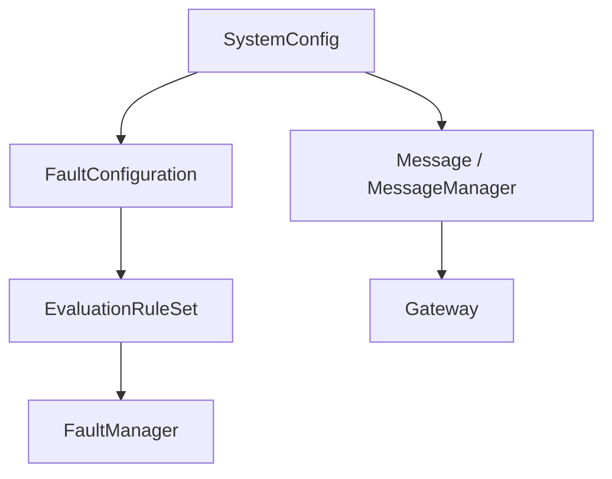
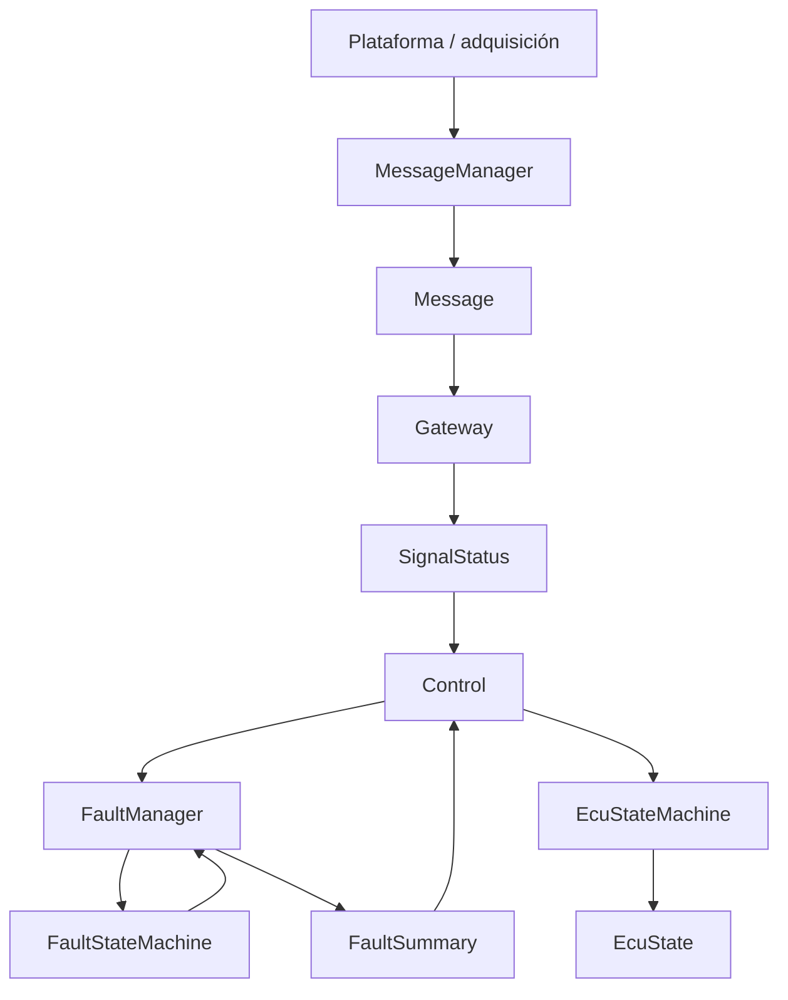
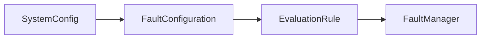
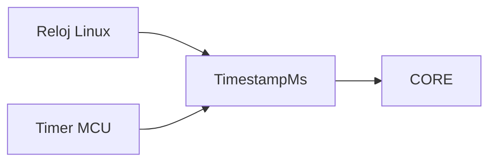
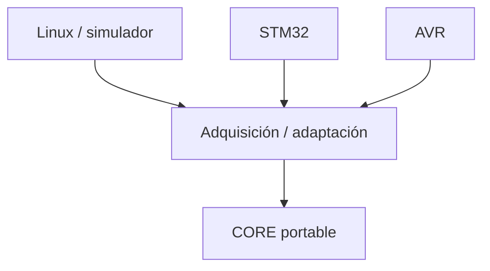

# Arquitectura

## Propósito

`myECU` separa la lógica portable de la ECU de los mecanismos específicos de
plataforma.

El CORE no debe conocer Linux, Windows, STM32, AVR, GPIO, ADC, UART ni ninguna
API específica del sistema operativo o microcontrolador.

La plataforma y la aplicación proporcionan los datos de entrada. El CORE
procesa esos datos y determina el estado lógico de la ECU.

---

## Fuente autoritativa de configuración

`SystemConfig` es la fuente autoritativa de configuración de las señales.

Contiene, entre otros datos:

- identidad de sensor;
- identidad de señal;
- límites válidos;
- timeout;
- severidad;
- tiempos de confirmación y recuperación;
- política de latching;
- configuración asociada a señales de control.

Las estructuras utilizadas posteriormente por el CORE deben derivarse de esta
configuración.

No debe existir una segunda definición manual de la misma política.



---

## Pipeline de procesamiento

El pipeline lógico actual es:



Las flechas representan flujo lógico y dependencias de datos, no ownership.

---

## Responsabilidades

| Componente | Responsabilidad | Conoce plataforma |
|---|---|:---:|
| `SystemConfig` | Fuente autoritativa de configuración de señales | No |
| `SignalId` | Identidad estable de una señal | No |
| `Message` | Representar el estado runtime de una señal necesario para su procesamiento | No |
| `MessageManager` | Inicializar y actualizar mensajes | No |
| `Gateway` | Evaluar rango y timeout y establecer `SignalStatus` | No |
| `EvaluationRule` | Representar política temporal diagnóstica derivada de configuración | No |
| `FaultConfiguration` | Construir y validar reglas derivadas de `SystemConfig` | No |
| `FaultStateMachine` | Gestionar confirmación, recuperación y latching de un fallo | No |
| `FaultManager` | Gestionar fallos por `SignalId` y producir `FaultSummary` | No |
| `DiagnosticStatus` | Representar errores internos relevantes para el control | No |
| `Control` | Coordinar `SignalStatus`, diagnóstico, fallos y entradas de la FSM global | No |
| `EcuStateMachine` | Determinar el estado global de la ECU | No |
| Plataforma / drivers | Adquirir señales y proporcionar servicios específicos de hardware/SO | Sí |
| Simulador | Generar señales artificiales para ejecutar el CORE en host | Sí |

---

## Separación de responsabilidades diagnósticas

### Gateway

`Gateway` es responsable de determinar el estado inmediato de una señal.

Evalúa:

- rango;
- timeout.

Produce:

```text
SignalStatus
```

El resto del CORE no debe repetir estas comparaciones.

### Control

`Control` interpreta el `SignalStatus` ya determinado por `Gateway`.

No debe volver a comparar:

- `rawValue` contra `minValue`;
- `rawValue` contra `maxValue`;
- timestamps contra `timeoutMs`.

Transforma el estado de las señales y las condiciones del sistema en entradas
para la gestión de fallos y para `EcuStateMachine`.

### FaultStateMachine

`FaultStateMachine` no evalúa valores físicos.

Gestiona exclusivamente comportamiento temporal del fallo:

- confirmación;
- recuperación;
- latching.

### FaultManager

`FaultManager` administra el estado diagnóstico por `SignalId`.

Recibe una condición de fallo ya determinada y utiliza la política temporal
correspondiente.

También construye `FaultSummary`.

### EcuStateMachine

`EcuStateMachine` determina las transiciones globales de la ECU a partir de
entradas abstractas.

No debe conocer:

- sensores concretos;
- valores ADC;
- GPIO;
- registros;
- drivers;
- plataformas.

---

## Configuración diagnóstica derivada

Las reglas diagnósticas no constituyen una segunda fuente de configuración.

`EvaluationRule` se deriva de `SystemConfig`.



Una modificación de política debe realizarse en la configuración autoritativa y
propagarse al resto del sistema mediante construcción o derivación.

---

## Dependencias permitidas

El CORE puede utilizar abstracciones C++ portables compatibles con los
toolchains objetivo.

Actualmente utiliza tipos de ancho fijo, `std::size_t` y estructuras de tamaño
fijo como `std::array`.

El CORE:

- no consulta directamente el reloj del sistema;
- no duerme;
- no imprime;
- no lee teclado;
- no utiliza APIs POSIX;
- no accede directamente a GPIO;
- no accede directamente a ADC;
- no configura interrupciones;
- no depende de HAL/CMSIS;
- no depende de registros AVR.

Los timestamps entran al CORE como:

```cpp
TimestampMs
```

Conceptualmente:



La utilización de `std::array` no constituye por sí misma una dependencia de
Linux. Su compatibilidad debe comprobarse mediante los toolchains oficialmente
soportados.

---

## Ownership y memoria

La aplicación posee los objetos principales necesarios para ejecutar el CORE.

`FaultManager` mantiene una referencia no propietaria al conjunto de reglas que
se le proporciona. La vida útil del almacenamiento de dichas reglas debe ser
superior a la del uso realizado por `FaultManager`.

El CORE utiliza almacenamiento de capacidad fija.

No debe introducir:

- crecimiento dinámico de contenedores;
- asignación dinámica innecesaria;
- ownership implícito;
- dependencias de memoria específicas de plataforma.

---

## Extensión con nuevas señales

Para agregar una nueva señal al pipeline actual:

1. asignar las identidades necesarias;
2. agregar la configuración correspondiente a `SystemConfig`;
3. permitir que la configuración diagnóstica derivada genere su
   `EvaluationRule`;
4. verificar las capacidades estáticas;
5. agregar o actualizar las pruebas correspondientes.

No debe agregarse manualmente una segunda definición de:

- rango;
- timeout;
- severidad;
- confirmación;
- recuperación;
- latching.

Agregar un sensor ordinario tampoco debe requerir modificar
`EcuStateMachine`.

---

## SignalSample y SignalStore

`SignalSample` y `SignalStore` permanecen bajo revisión arquitectónica.

Antes de considerarlos parte definitiva del pipeline se debe determinar si
representan una responsabilidad independiente de adquisición o si duplican
estado ya mantenido mediante `Message` y `MessageManager`.

Hasta completar esa revisión:

- no deben utilizarse como una segunda ruta diagnóstica;
- no deben evaluar rango o timeout;
- no deben mantener una segunda política de fallos;
- no deben considerarse una fuente autoritativa de configuración.

La decisión definitiva debe preservar un único pipeline diagnóstico para todas
las plataformas.

---

## Independencia de plataforma

La arquitectura objetivo es:



Linux, STM32 y AVR pueden implementar mecanismos diferentes de adquisición,
temporización y salida.

El CORE debe permanecer idéntico.

No debe existir:

```text
CORE Linux
CORE STM32
CORE AVR
```

Debe existir:

```text
un CORE
+
adaptadores/plataformas diferentes
```

---

## Decisiones de seguridad

- La configuración inválida debe ser detectada antes de utilizarla.
- Los errores internos relevantes deben propagarse mediante
  `DiagnosticStatus`.
- La regresión del reloj debe detectarse y tratarse explícitamente.
- Los límites de capacidad deben comprobarse antes de escribir.
- Los fallos configurados como latched no deben recuperarse mediante el
  mecanismo normal de recuperación.
- Una señal debe mantener un único estado diagnóstico autoritativo.
- El diagnóstico no debe depender de dos evaluadores paralelos del mismo dato.

---

## Invariantes arquitectónicos

La arquitectura debe mantener permanentemente los siguientes invariantes:

1. `SystemConfig` es la fuente autoritativa de configuración.
2. `Gateway` es el único responsable de evaluar rango y timeout.
3. `Control` consume `SignalStatus`; no vuelve a validar la señal.
4. `FaultStateMachine` gestiona comportamiento temporal, no valores físicos.
5. `FaultManager` administra fallos por identidad de señal.
6. `EcuStateMachine` no conoce sensores ni plataformas.
7. El CORE no conoce mecanismos específicos de hardware o sistema operativo.
8. Consola y plataformas embebidas deben utilizar el mismo pipeline del CORE.
9. No debe existir una segunda ruta diagnóstica.
10. Una nueva señal no debe requerir duplicar manualmente su política.