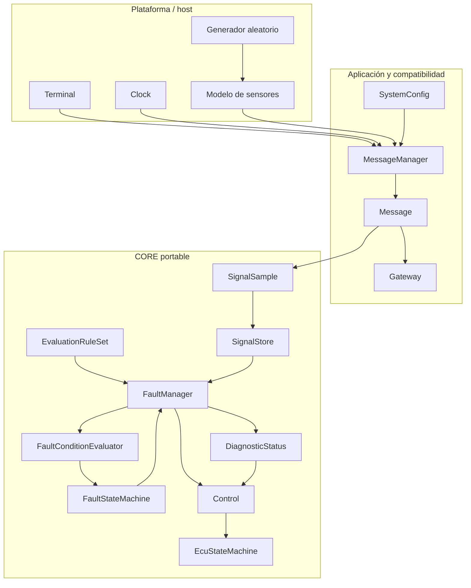
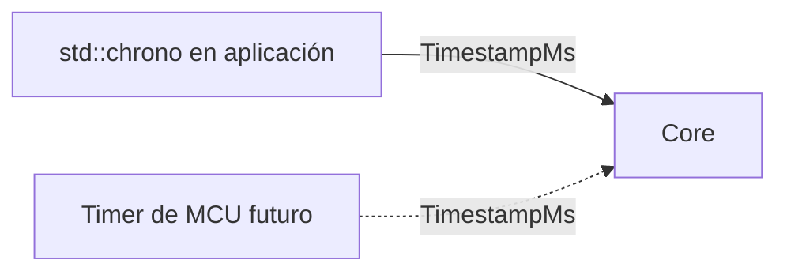
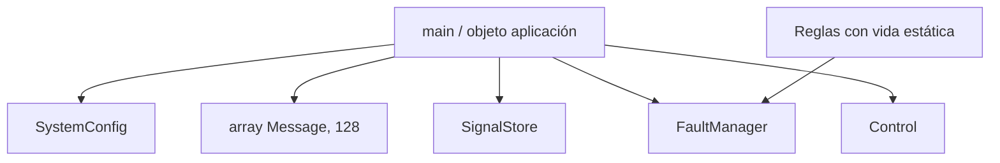

# Arquitectura

## Límites del sistema

Las flechas representan dependencias de datos, no ownership.

## Responsabilidades

| Componente | Responsabilidad | Conoce plataforma |
|---|---|:---:|
| `SignalId` | Identidad estable de una señal | No |
| `SignalSample` | Valor, timestamp y validez | No |
| `SignalStore` | Última muestra por identidad | No |
| `EvaluationRule` | Política configurable de evaluación | No |
| `FaultConditionEvaluator` | Convertir muestra y regla en condición | No |
| `FaultStateMachine` | Filtrado temporal del fallo | No |
| `FaultManager` | Ejecutar reglas y construir resumen | No |
| `DiagnosticStatus` | Normalizar errores internos | No |
| `Control` | Mantener el estado global | No |
| `EcuStateMachine` | Decidir transición global | No |
| `LinuxPlatform` | Teclado no bloqueante | Sí |
| `utils` | Reloj, aleatoriedad y consola | Sí |
| `sensor_simulation` | Dinámica artificial de señales | Simulador |

## Dependencias permitidas

El CORE usa tipos de ancho fijo, `std::size_t` y `std::array`. No consulta el
reloj, no duerme, no imprime, no lee teclado y no usa APIs POSIX. Los timestamps
entran como `TimestampMs`.

`std::array` no es una dependencia de Linux: es un contenedor C++ de tamaño
fijo. La independencia absoluta se confirma al compilar con el toolchain real.

## Ownership y memoria

- La aplicación posee los objetos principales.
- `FaultManager` mantiene un puntero no propietario a reglas de vida estática.
- Los arreglos reservan su capacidad completa al construirse.
- No hay crecimiento dinámico ni invalidación de direcciones por reallocación.

## Extensión con nuevas señales

Para agregar una señal:

1. asignar un `SignalId` único;
2. agregar metadatos a `SystemConfig`;
3. agregar una o más `EvaluationRule`;
4. validar que no se excedan las capacidades;
5. agregar pruebas de configuración y comportamiento.

No debe modificarse `Control` ni `EcuStateMachine` por cada sensor nuevo.

## Decisiones de seguridad

- Configuración inválida y errores de evaluación producen diagnóstico no
  disponible y conducen a una respuesta fail-safe.
- El reloj regresivo se reporta como `CLOCK_ERROR`.
- Las muestras antiguas no reemplazan una muestra más nueva.
- Los límites de capacidad se comprueban antes de escribir.
- Los fallos latched requieren un ciclo de ignición explícito.
