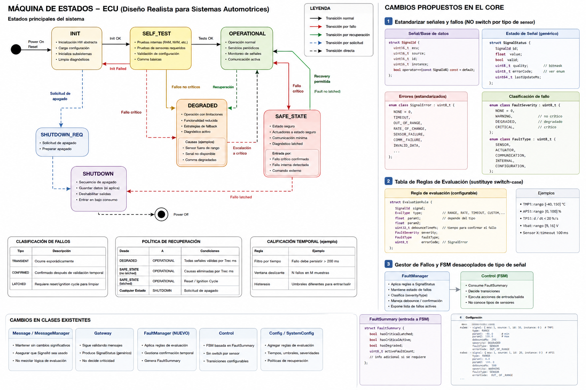
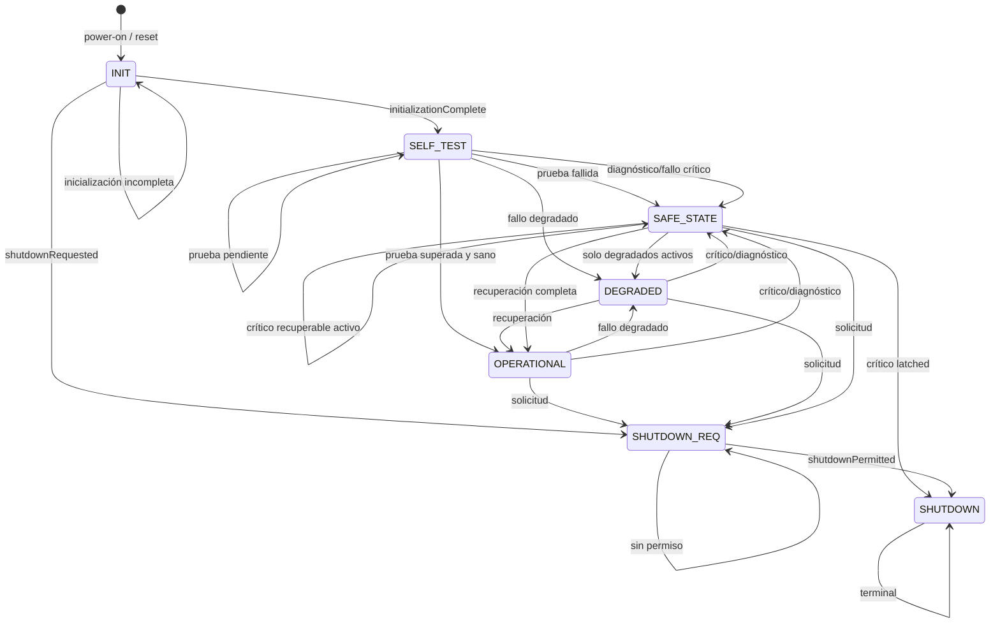
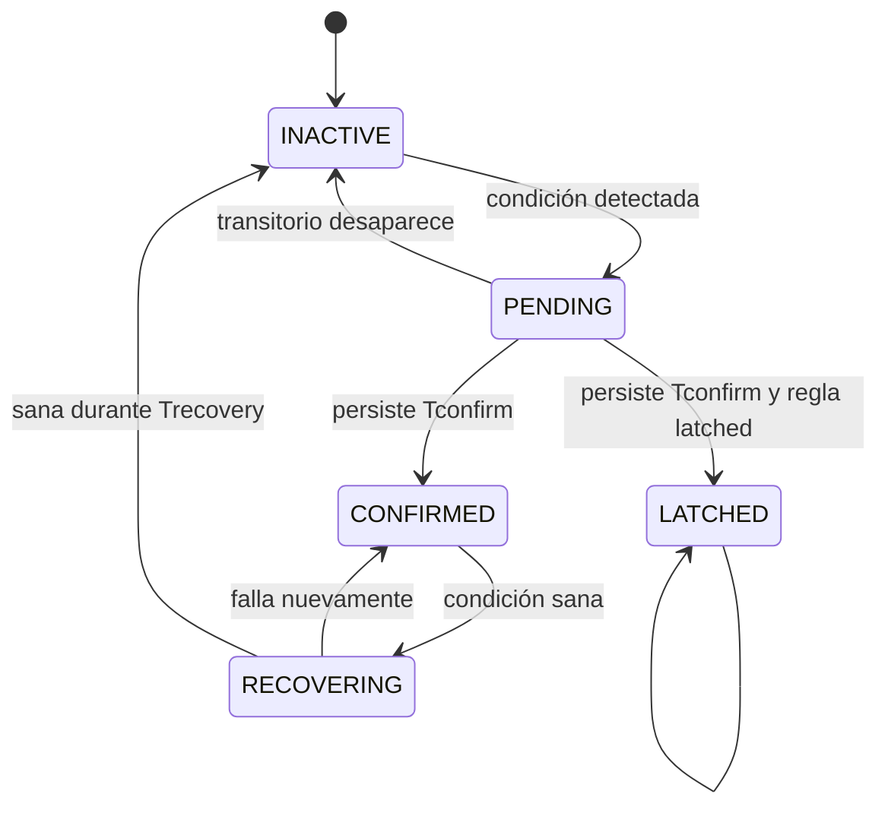
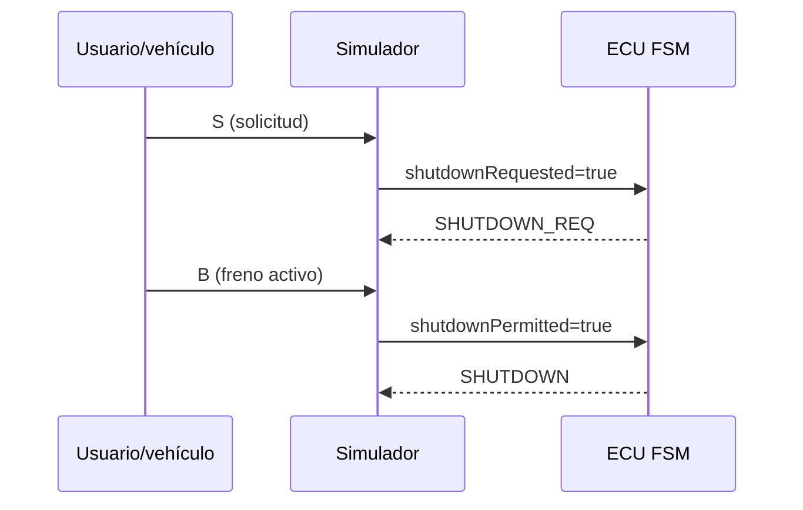

# Máquinas de estados

La referencia visual original se conserva en [FSM.png](img/FSM.png).

## FSM global

### Entradas

| Entrada | Significado |
|---|---|
| `FaultSummary faults` | Resumen independiente del origen de las señales |
| `initializationComplete` | Inicialización de aplicación terminada |
| `selfTestResult` | Pendiente, aprobado o fallido |
| `shutdownRequested` | Solicitud lógica de apagado |
| `shutdownPermitted` | Condición externa segura para finalizar |
| `diagnosticStatus` | Disponibilidad del procesamiento interno |

### Tabla resumida

| Estado | Condición dominante | Destino |
|---|---|---|
| `INIT` | inicialización completa | `SELF_TEST` |
| `SELF_TEST` | prueba fallida | `SAFE_STATE` |
| `SELF_TEST` | sano | `OPERATIONAL` |
| `OPERATIONAL` | degradado confirmado | `DEGRADED` |
| `DEGRADED` | recuperación completa | `OPERATIONAL` |
| `OPERATIONAL/DEGRADED` | crítico | `SAFE_STATE` |
| `SAFE_STATE` | crítico latched | `SHUTDOWN` |
| estado no terminal | solicitud normal | `SHUTDOWN_REQ` |
| `SHUTDOWN_REQ` | permiso seguro | `SHUTDOWN` |

La implementación realiza una transición por ciclo. Por ejemplo, un latched
detectado en operación produce primero `SAFE_STATE` y en el ciclo siguiente
`SHUTDOWN`.

## FSM de cada fallo

Este filtrado evita que una única muestra espuria cambie inmediatamente el
estado global. `RECOVERING` sigue contándose como fallo activo hasta completar
el tiempo de recuperación.

## Apagado normal y apagado por fallo

El freno es solo la representación actual del permiso en el simulador. En una
ECU real el permiso puede combinar velocidad cero, estado del tren motriz,
energía disponible y confirmación de otros controladores.
