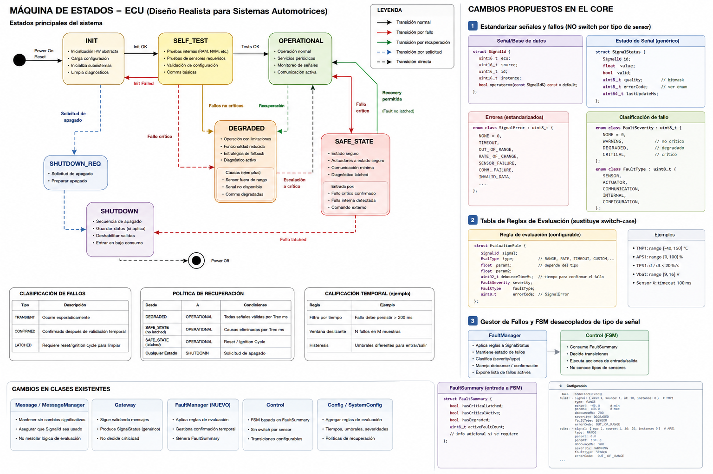
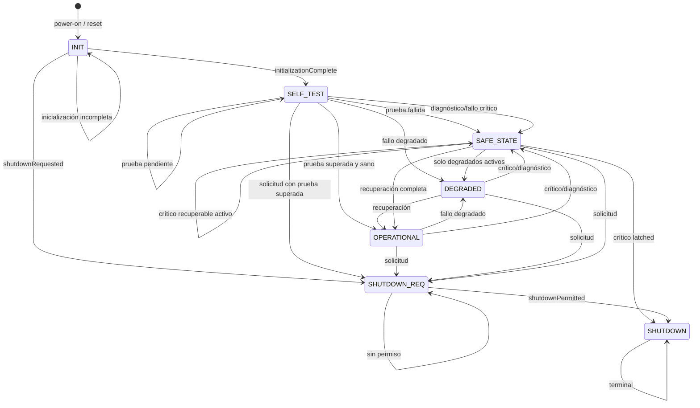
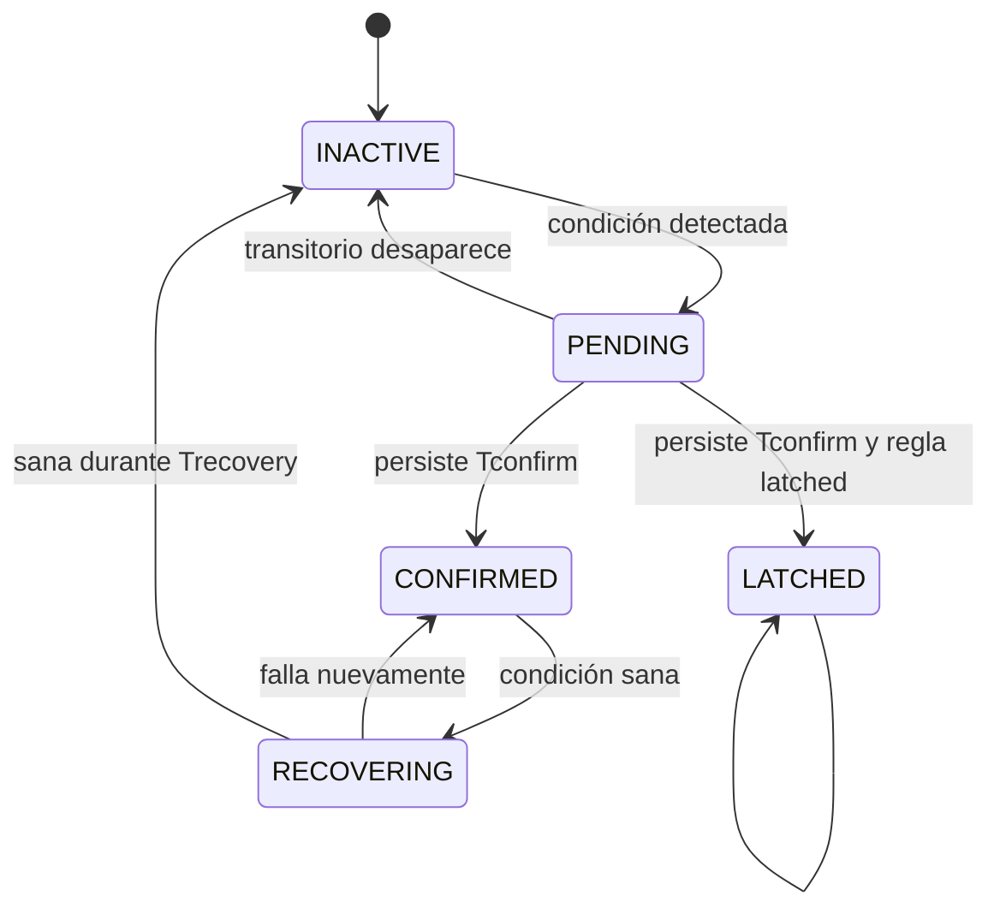
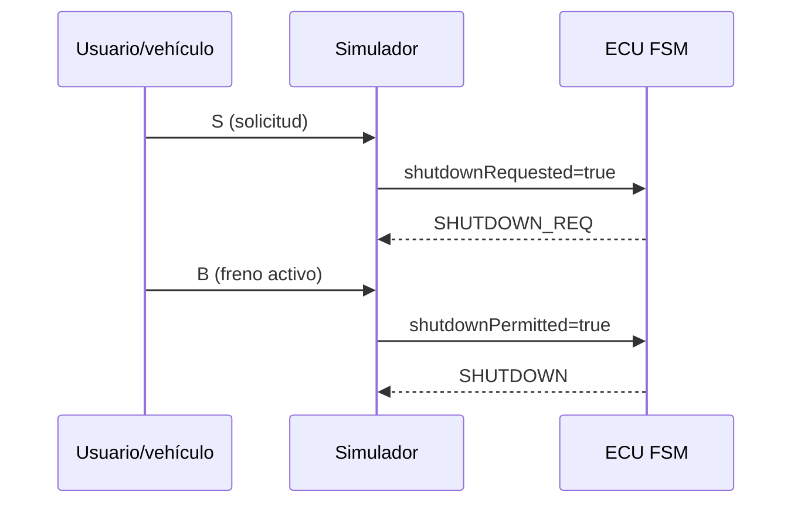

# Máquinas de estados

La referencia visual original se conserva en [FSM.png](img/FSM.png).

## FSM global

```mermaid
stateDiagram-v2
    [*] --> INIT: power-on / reset
    INIT --> INIT: inicialización incompleta
    INIT --> SELF_TEST: initializationComplete
    INIT --> SHUTDOWN_REQ: shutdownRequested

    SELF_TEST --> SELF_TEST: prueba pendiente
    SELF_TEST --> SAFE_STATE: prueba fallida
    SELF_TEST --> SAFE_STATE: diagnóstico/fallo crítico
    SELF_TEST --> SHUTDOWN_REQ: solicitud con prueba superada
    SELF_TEST --> DEGRADED: fallo degradado
    SELF_TEST --> OPERATIONAL: prueba superada y sano

    OPERATIONAL --> DEGRADED: fallo degradado
    DEGRADED --> OPERATIONAL: recuperación
    OPERATIONAL --> SAFE_STATE: crítico/diagnóstico
    DEGRADED --> SAFE_STATE: crítico/diagnóstico

    SAFE_STATE --> SAFE_STATE: crítico recuperable activo
    SAFE_STATE --> DEGRADED: solo degradados activos
    SAFE_STATE --> OPERATIONAL: recuperación completa
    SAFE_STATE --> SHUTDOWN: crítico latched

    OPERATIONAL --> SHUTDOWN_REQ: solicitud
    DEGRADED --> SHUTDOWN_REQ: solicitud
    SAFE_STATE --> SHUTDOWN_REQ: solicitud
    SHUTDOWN_REQ --> SHUTDOWN_REQ: sin permiso
    SHUTDOWN_REQ --> SHUTDOWN: shutdownPermitted
    SHUTDOWN --> SHUTDOWN: terminal
```

### Entradas

| Entrada | Significado |
|---|---|
| `FaultSummary faults` | Resumen independiente del origen de las señales |
| `initializationComplete` | Inicialización de aplicación terminada |
| `selfTestResult` | Pendiente, aprobado o fallido |
| `shutdownRequested` | Solicitud lógica de apagado |
| `shutdownPermitted` | Condición externa segura para finalizar |
| `diagnosticStatus` | Disponibilidad del procesamiento interno |

### Tabla resumida

| Estado | Condición dominante | Destino |
|---|---|---|
| `INIT` | inicialización completa | `SELF_TEST` |
| `SELF_TEST` | prueba fallida | `SAFE_STATE` |
| `SELF_TEST` | sano | `OPERATIONAL` |
| `OPERATIONAL` | degradado confirmado | `DEGRADED` |
| `DEGRADED` | recuperación completa | `OPERATIONAL` |
| `OPERATIONAL/DEGRADED` | crítico | `SAFE_STATE` |
| `SAFE_STATE` | crítico latched | `SHUTDOWN` |
| `INIT` | solicitud (prioridad sobre inicialización completa) | `SHUTDOWN_REQ` |
| `SELF_TEST` | prueba superada, sin crítico/diagnóstico y solicitud | `SHUTDOWN_REQ` |
| `OPERATIONAL/DEGRADED` | solicitud sin crítico/diagnóstico | `SHUTDOWN_REQ` |
| `SAFE_STATE` | solicitud sin crítico latched | `SHUTDOWN_REQ` |
| `SHUTDOWN_REQ` | permiso seguro | `SHUTDOWN` |

La implementación realiza una transición por ciclo. Por ejemplo, un latched
detectado en operación produce primero `SAFE_STATE` y en el ciclo siguiente
`SHUTDOWN`.

### Prioridades y adaptación actual

En `SELF_TEST`, una prueba pendiente mantiene el estado; una fallida lleva a
seguro. Después de aprobarla, diagnóstico y crítico preceden a solicitud,
degradado y operación. `OPERATIONAL` y `DEGRADED` aplican ese mismo orden.
En `SAFE_STATE`, crítico latched precede a solicitud, diagnóstico, crítico
recuperable, degradado y operación. `SHUTDOWN_REQ` solo espera permiso.

`Control::processMessages()` suministra inicialización completa y self-test
aprobado en cada llamada. El estado `SELF_TEST` no implica todavía una
comprobación física. `Control::reset()` reinicia la FSM global; limpiar los
registros requiere también el reset de `FaultManager`.

El registro TXT del modo automático observa las transiciones después del ciclo;
el CSV guarda los valores y el estado global en cada ciclo. Ninguno altera
la FSM ni registra todos los pasos internos de cada fallo.
Véase [LOGGING.md](LOGGING.md).

## FSM de cada fallo

```mermaid
stateDiagram-v2
    [*] --> INACTIVE
    INACTIVE --> PENDING: condición detectada
    PENDING --> INACTIVE: transitorio desaparece
    PENDING --> CONFIRMED: persiste Tconfirm
    PENDING --> LATCHED: persiste Tconfirm y regla latched
    CONFIRMED --> RECOVERING: condición sana
    RECOVERING --> CONFIRMED: falla nuevamente
    RECOVERING --> INACTIVE: sana durante Trecovery
    LATCHED --> LATCHED
```

Este filtrado evita que una única muestra espuria cambie inmediatamente el
estado global. `RECOVERING` sigue contándose como fallo activo hasta completar
el tiempo de recuperación.

## Apagado normal y apagado por fallo

```mermaid
sequenceDiagram
    participant Driver as Usuario/vehículo
    participant App as Simulador
    participant FSM as ECU FSM
    Driver->>App: S (solicitud)
    App->>FSM: shutdownRequested=true
    FSM-->>App: SHUTDOWN_REQ
    Driver->>App: B (freno activo)
    App->>FSM: shutdownPermitted=true
    FSM-->>App: SHUTDOWN
```

El freno es solo la representación actual del permiso en el simulador. En una
ECU real el permiso puede combinar velocidad cero, estado del tren motriz,
energía disponible y confirmación de otros controladores.
