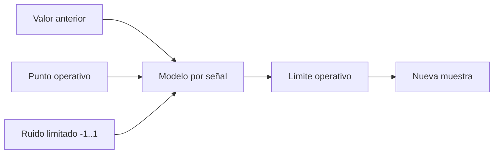

# Simulaciones

## Modos

```bash
./ecu          # entrada manual
./ecu -auto    # evolución automática
```

La simulación es una capa de demostración. `std::chrono`, terminal, strings,
aleatoriedad y pausas no forman parte de la FSM portable.

## Modelo automático

Antes, cada ciclo elegía cualquier valor entre los extremos ampliados del
rango. Eso permitía saltos físicamente irreales y hacía frecuente un fallo
latched de voltaje. Ahora se calcula:

```text
nuevo = actual + (objetivo - actual) × respuesta + ruido limitado
```

y después se aplica un límite operativo propio de cada señal.



| Señal | Comportamiento simulado |
|---|---|
| Velocidad | aproxima gradualmente 60 km/h |
| RPM | aproxima 1800 rpm con fluctuación limitada |
| Temperatura | calentamiento lento hacia 90 °C |
| Voltaje | regulación alrededor de 13.8 V |
| TPS | aproxima una apertura parcial estable |
| MAP | aproxima una presión de operación media |
| MAF | aproxima un flujo moderado |
| O₂ | variación limitada alrededor de 0.45 V |
| Freno | entrada discreta controlada por `B` |
| Apagado | entrada discreta controlada por `S` |

El modelo busca continuidad y pruebas reproducibles de invariantes; no pretende
ser un modelo termodinámico de motor.

## Controles

- `B` o `b`: alterna el freno.
- `S` o `s`: mantiene activa la solicitud de apagado.

Presionar `S` cambia a `SHUTDOWN_REQ`. Para terminar normalmente también debe
activarse `B`, que representa `shutdownPermitted`.

## Inyección manual de fallos

El modo manual permite cargar valores fuera de rango y observar confirmación y
recuperación. Ejemplos:

| Prueba | Valor | Resultado después de confirmación |
|---|---:|---|
| velocidad alta | 250 km/h | `DEGRADED` |
| RPM alta | 7500 rpm | `SAFE_STATE` |
| temperatura alta | 150 °C | `SAFE_STATE` |
| voltaje bajo | 7 V | `SAFE_STATE`, después `SHUTDOWN` por latched |

Los tiempos de confirmación usan timestamps reales; por eso deben procesarse
varios ciclos para confirmar o recuperar un fallo.

## Evolución futura

Una simulación más avanzada debería incluir perfiles de conducción, relaciones
RPM/TPS/MAP/MAF, encendido y apagado de motor, inyección explícita de timeout,
fallos intermitentes y semillas reproducibles.
