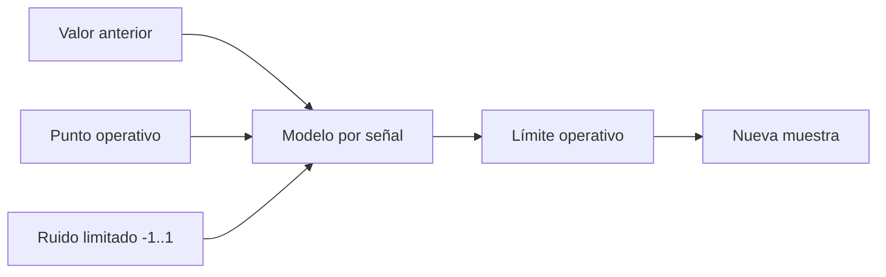

# Simulaciones

## Modos

```bash
./ecu          # entrada manual
./ecu -auto    # evolución automática con registro TXT
./ecu -auto -csv  # evolución automática con registro CSV
```

La simulación es una capa de demostración. `std::chrono`, terminal, strings,
aleatoriedad y pausas no forman parte de la FSM portable.

## Modelo automático

El ciclo automático tiene una pausa nominal de 500 ms. Cada señal evoluciona
a partir de su valor anterior mediante:

```text
nuevo = actual + (objetivo - actual) × respuesta + ruido limitado
```

y después se aplica un límite operativo propio de cada señal.


```mermaid
flowchart LR
    Previous[Valor anterior] --> Model[Modelo por señal]
    Target[Punto operativo] --> Model
    Noise[Ruido limitado -1..1] --> Model
    Model --> Clamp[Límite operativo]
    Clamp --> Sample[Nueva muestra]
```

| Señal | Comportamiento simulado |
|---|---|
| Velocidad | aproxima gradualmente 60 km/h |
| RPM | aproxima 1800 rpm con fluctuación limitada |
| Temperatura | calentamiento lento hacia 90 °C |
| Voltaje | regulación alrededor de 13.8 V |
| TPS | aproxima una apertura parcial estable |
| MAP | aproxima una presión de operación media |
| MAF | aproxima un flujo moderado |
| O₂ | variación limitada alrededor de 0.45 V |
| Presión de aceite | aproxima 3 bar dentro del rango 1–6 bar |
| Freno | entrada discreta controlada por `B` |
| Apagado | entrada discreta controlada por `S` |

El modelo busca continuidad; sus invariantes se prueban pasando ruido
controlado a `simulateSensorValue()`. Las demostraciones automáticas usan
`random_device` y no ofrecen semilla fija. No es un modelo termodinámico
de motor ni relaciona todavía TPS, RPM y velocidad.

## Controles

- `B` o `b`: alterna el freno.
- `S` o `s`: mantiene activa la solicitud de apagado.

Presionar `S` cambia a `SHUTDOWN_REQ`. Para terminar normalmente también debe
activarse `B`, que representa `shutdownPermitted`.

## Inyección manual de fallos

El modo manual permite cargar valores fuera de rango y observar confirmación y
recuperación. Procesa al terminar la entrada de señales; no ejecuta un ciclo
continuo mientras espera teclado y no escribe archivos de registro. Ejemplos:

| Prueba | Valor | Resultado después de confirmación |
|---|---:|---|
| velocidad alta | 250 km/h | `DEGRADED` |
| RPM alta | 7500 rpm | `SAFE_STATE` |
| temperatura alta | 150 °C | `SAFE_STATE` |
| voltaje bajo | 7 V | `SAFE_STATE`, después `SHUTDOWN` por latched |

Los tiempos de confirmación usan timestamps reales; por eso deben procesarse
varios ciclos para confirmar o recuperar un fallo.

## Ventanas automáticas de fallo

La primera selección ocurre después de 30 ciclos (aproximadamente 15 s).
Cada señal de los índices 2–10 que no sea `LATCHED` tiene una probabilidad
de selección del 50 %;
para las seleccionadas, el tipo tiene una probabilidad del 50 % de timeout
frente a fuera de rango. La solicitud de apagado y el freno quedan excluidos.

El tipo se mantiene durante 20 ciclos (unos 10 s), seguido de 10 ciclos
sin inyección antes de la siguiente selección. En timeout no se actualiza
el mensaje; en fuera de rango se escribe `maxValue + 1`. La ventana de timeout
empieza antes de que venza la edad de la última muestra. Confirmación y
recuperación se resuelven después según los tiempos diagnósticos.

Las señales `LATCHED`, actualmente Voltaje, quedan excluidas de la selección
aleatoria. Esto no modifica el diagnóstico ni su recuperación: la inyección
manual de voltaje inválido sigue permitiendo observar el apagado enclavado.

## Registro TXT y CSV

`./ecu -auto` crea `logs/txt/<timestamp>.txt` y escribe las transiciones
globales después de procesar el ciclo, incluida la final a `SHUTDOWN`.
Al entrar en `DEGRADED` o `SAFE_STATE`, agrega nombre, estado de señal,
estado del fallo y último valor/unidad para los fallos activos.

`./ecu -auto -csv` crea `logs/csv/<timestamp>.csv`. Escribe una cabecera con
nombres y unidades, seguida de una fila por ciclo con valores a cuatro
decimales y `ECU_STATE`, incluido el ciclo final de apagado. No contiene
columna temporal, validez ni causas individuales de fallo; un timeout puede
conservar el valor anterior. La pausa nominal es 500 ms, más procesamiento y E/S.

Las carpetas se crean automáticamente respecto al directorio de trabajo.
El nombre usa el reloj monotónico y no representa fecha/hora. La apertura
es append y los nombres no garantizan unicidad. Git ignora toda `logs/`.
TXT no registra cambios de fallo si `EcuState` permanece igual. Los detalles
de formato, errores de E/S y ciclo de vida están en [LOGGING.md](LOGGING.md).

## Evolución futura

Una simulación más avanzada debería incluir perfiles de conducción, relaciones
RPM/TPS/MAP/MAF, encendido y apagado de motor, selección explícita de escenarios,
fallos intermitentes y semillas reproducibles. La inyección aleatoria de
timeout y rango ya está implementada.
