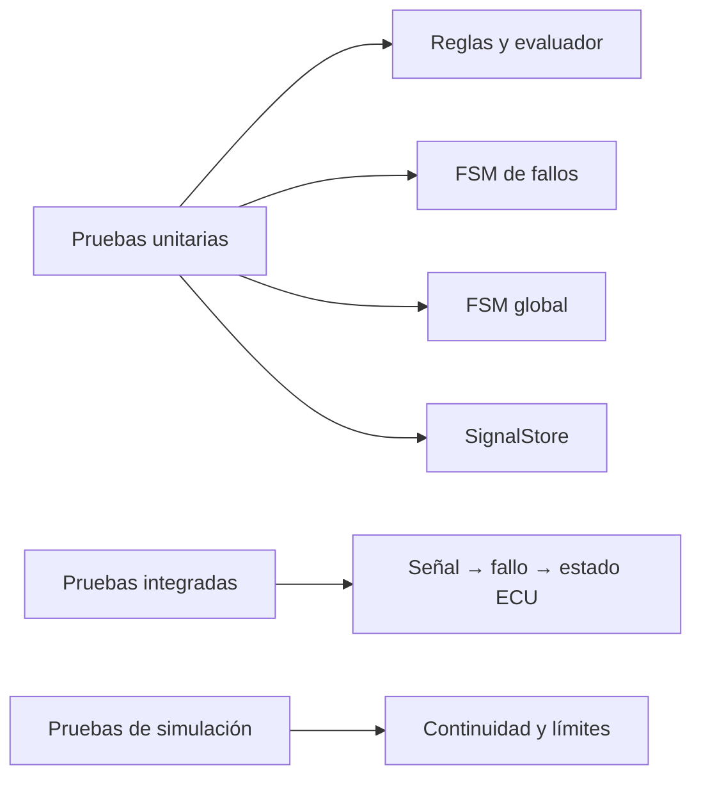

# Compilación y pruebas

## CMake

```bash
cmake -S . -B build-cmake -DCMAKE_BUILD_TYPE=Debug
cmake --build build-cmake
ctest --test-dir build-cmake --output-on-failure
```

## Makefile

```bash
make test
make build
make run
```

## Perfil embebido

```bash
cmake -S . -B build-embedded \
  -DBUILD_ECU_SIMULATOR=OFF \
  -DECU_CORE_EMBEDDED_PROFILE=ON
cmake --build build-embedded
ctest --test-dir build-embedded --output-on-failure
```

En GCC/Clang activa `-ffreestanding`, `-fno-exceptions`, `-fno-rtti`,
`-fno-threadsafe-statics` y `-fno-use-cxa-atexit`.

## Cobertura funcional actual



CTest registra 13 suites:

1. Gateway legado.
2. Control.
3. Tipos de fallo.
4. Reglas de evaluación.
5. FSM individual de fallos.
6. Evaluador de condiciones.
7. FaultManager.
8. FSM global.
9. SignalStore.
10. Configuración de fallos.
11. Estado de diagnóstico.
12. Integración completa.
13. Modelo de sensores.

Se prueban límites exactos, timestamps futuros/regresivos, capacidad fija,
configuraciones inválidas, confirmación, recuperación, latching, apagado normal
y terminalidad.

## Sanitizadores

```bash
cmake -S . -B build-sanitized \
  -DCMAKE_CXX_FLAGS="-fsanitize=address,undefined -fno-omit-frame-pointer"
cmake --build build-sanitized
ASAN_OPTIONS=detect_leaks=0 \
  ctest --test-dir build-sanitized --output-on-failure
```

`detect_leaks=0` solo es necesario en entornos donde LeakSanitizer no funciona
bajo `ptrace`. AddressSanitizer y UndefinedBehaviorSanitizer continúan activos.

## Qué falta validar en hardware

- mapa de memoria y secciones del linker;
- stack máximo y ausencia efectiva de heap;
- WCET y jitter por tarea;
- wrap-around del timer objetivo;
- endianess, alineación y ABI;
- comportamiento bajo interrupciones y concurrencia;
- pruebas PIL/HIL e inyección de fallos eléctricos.
